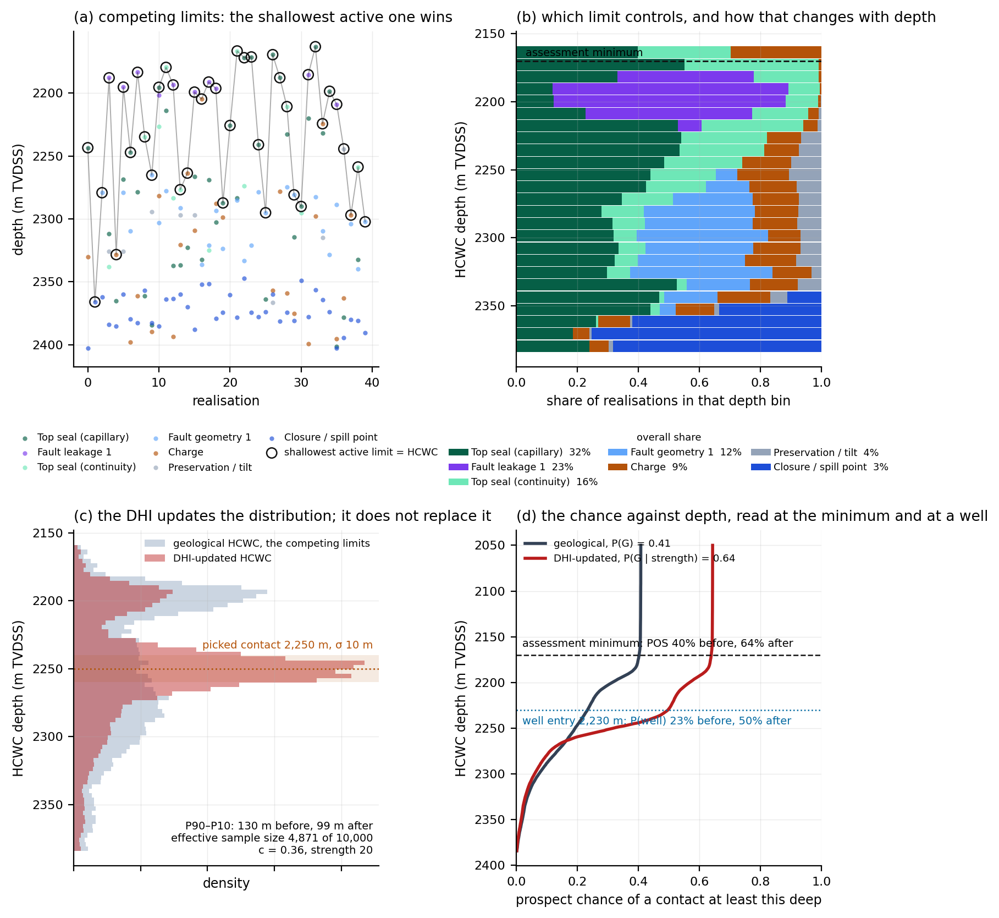

# Let the geology generate the distribution

### Hydrocarbon column height from competing geological limits and DHI evidence

*Lars Hjelm, September 2026. The long-form manuscript this shortens is kept as
`docs/ARTICLE_LONG_2026-09.md`; the method is stated in full on tab 8.1 of the HCWC
Distribution Builder.*

---

## The distribution nobody chose

The depth of the hydrocarbon–water contact is often the largest single uncertainty in a
prospect's volume, and it sets the chance that a well at a given location finds hydrocarbons
at all. In most evaluations it is entered as a distribution: uniform from apex to spill point,
a three-point estimate from analogues, a lognormal of the column. Uniform? Normal? Lognormal?
Perhaps the company standard has already decided.

Whatever the choice, the distribution carries no connection to the mechanisms that limit the
column. It cannot say which assumption it rests on, which mechanism a deeper contact would
need, or what to change after the well. A surprisingly sophisticated Monte Carlo model can
still answer a poorly posed geological question.

The alternative is older than the software. Geological mechanisms limit the column: charge runs
out, the closure spills, a fault juxtaposes the reservoir against a carrier, the seal leaks at a
capillary pressure the column exceeds, the seal breaks in tension, the reservoir pinches out.
Each is a limit with two properties: a probability of being present on this prospect, and a
distribution of the depth or column height at which it acts. Let those compete, and the contact
distribution follows.

## Competing limits

In every Monte Carlo realisation each limit is drawn twice, once for presence and once for the
depth at which it acts, and the shallowest active limit sets the contact. The mechanism that set
it is recorded. Ten thousand realisations give a contact distribution, a controlling share for
each mechanism, and both as functions of depth (figure, panels a and b).

This is not new. Beha, Christensen and Young (2012) enumerate the combinations of trapping
elements sealing or failing and derive the leak point that follows; Hood (2019, 2024) frames
column height as a competition between limits; Grant (2020) publishes the controlling-limit
statistic; Lowry et al. (2005) had chance against column height two decades ago. What is added
here is the integration: continuous, correlated limit distributions; the controller retained
per realisation; one framework for the contact, the chance against depth and the well; DHI
evidence entered as a likelihood over column height; and an empirical comparison that treats the
filled-to-spill record as censored. The engine reproduces Beha's two-fault example
(0.60 / 0.12 / 0.28 at three leak points) to Monte Carlo error, which is its external check.

Limits are sampled, not blended. Averaging a leak into a background column distribution
suppresses the realisations above the leak and leaves the rest untouched, so the blended
distribution corresponds to no geology, and adding a leak can raise the apparent volume. Taking
the minimum keeps every realisation a column some mechanism can produce.

## One realisation, step by step

Take realisation 64 of the worked prospect, at the shipped seed. The apex is drawn first, at
2 050 m, because every capacity is measured down from it. The spill point is a mapped surface,
and on this draw it sits 348 m below the apex. The charge calculator has delivered enough oil to
fill 263 m of that. The top seal's capillary capacity comes out at 150 m: a throat radius, an
interfacial tension and a density contrast drawn from their ranges and turned into a column.
Fault leakage 1 is present in a quarter of realisations, and in this one it is present, with a
leak capacity of 146 m. Seal continuity is present too, at 184 m; a fault juxtaposition window
sits at 265 m. Preservation, the base seal and the second fault are drawn absent, so the columns
sampled for them, 247, 139 and 261 m, sit in the record and take no part.

Six limits are active. The shallowest is fault leakage 1 at 146 m, so the contact in this
realisation is 2 050 + 146 = 2 196 m and the controller is fault leakage. The seal would have
held 4 m more; the charge would have filled 117 m more; nobody asks the spill. Had the leakage
been drawn absent, the top seal would have set the contact at 2 200 m, and the record would say
seal. That the two sit 4 m apart is why both appear near the top of the controlling table:
on this prospect the seal and the leak are the competition.

Ten thousand of these, and the tally is the controlling-mechanism table below; the contacts are
the distribution; and each realisation still carries its own apex, so a well entering at
2 230 m can be tested against every one of them. Two draws per limit are the model's whole
vocabulary: whether the mechanism is there, and where it acts if it is. Correlation between
limits, where it is elicited, enters through a Gaussian copula on the depth draws; presence
draws stay independent, which is stated rather than hidden.

## The model shows why the column stops

On the worked prospect, a 350 m closure at 2 050 m with a computed seal capacity and a computed
charge, the contact comes out at 2 191 / 2 246 / 2 322 m (P90 / P50 / P10), read over the
realisations that reach the assessment minimum. Top-seal capillary
capacity sets it in 32 % of realisations, fault leakage in 23 %, seal continuity in 16 %, fault
geometry in 12 %, charge in 9 %, spill in 3 %. The share is not constant down the structure:
shallow contacts are seal-controlled, deep ones pass to fault geometry and spill (panel b).

That table is the sensitivity analysis. Two or three limits set the answer and the rest do not
move it, so the elicitation effort goes where it counts, and a reviewer can disagree with a
mechanism rather than with a curve.

## The chance is a reading of the same curve

The exceedance curve $F(h) = P(H \geq h \mid G)$ is the chance that the column reaches $h$,
given that the geological elements worked. The prospect chance at the assessment minimum, the
smallest column that counts as a discovery, is

$$\mathrm{POS} = P(G) \times F(h_{\min})$$

where $P(G)$ is the product of the element chances. A chance quoted without its threshold means
nothing; read at every depth, the same product is the chance against depth, and read at a
well's entry depth it is the chance that well finds hydrocarbons (panel d). Chance and volume
come off one curve, so they cannot refer to different thresholds.

A trapping element that fails below the crest, a fault window at 2 300 m or a seal that holds
150 m, does not reduce the chance of finding hydrocarbons at the well; it reduces the chance of
a deeper contact. Folding it into $P(G)$ understates the chance and, because volume is
conditioned on it, overstates the volume. Here such mechanisms are limits, and $P(G)$ is left
to what works at the crest.

## The DHI updates the distribution; it does not replace it

A seismic amplitude with a picked termination is not a contact. It is evidence about one, and
it carries two kinds. Its character, how hydrocarbon-like it reads, is evidence about whether
there are hydrocarbons: a likelihood ratio $R$ from two elicited populations, applied to $P(G)$
by the two-state Bayesian update $P(G \mid s) = R\,P(G) / (R\,P(G) + 1 - P(G))$. Its geometry,
where the picked event terminates, is evidence about how far down the column reaches, given
that it exists: a likelihood over column height that reweights the geological realisations.
Nothing is re-simulated; every realisation keeps its controlling mechanism.

The geometry likelihood has a floor. The picked event is the contact with a stated probability
$c$, the contact-attribution judgement; with probability $1 - c$ it is lithology, a diagenetic
front or an artefact, and then it says nothing about depth. So the depth channel can never say
more than $c/(1-c)$ against any contact depth, however sharply the pick is drawn. Nothing is
ruled out by one interpretation.

On the worked prospect a moderate anomaly with a 10 m pick at 2 250 m and $c = 0.36$ takes the
prospect chance from 40 % to 64 % and narrows the P90–P10 spread of the contact from 130 m to
99 m (panels c and d). The chance at a well entering at 2 230 m goes from 23 % to 50 %. The
updated distribution rests on an effective 4 871 of the 10 000 realisations, which is the honest
measure of how far the seismic displaced the geology: a low value does not mean the
interpretation is wrong, it means the answer depends on it.

Two things the update does not do. A strong amplitude raises $P(G)$ and does not narrow the
contact: the depth uncertainty stays with the pick, the depth conversion and the attribution,
and hydrocarbon presence can become highly likely while the contact keeps a finite spread. And
the DHI cannot say which element failed. It may say where the contact is, and mechanisms that
put a contact there become more frequent among the favoured realisations; the element chances
are untouched.

An absent anomaly, where one would have been detectable, is evidence too: within the geological
model it argues for a short column, and on the chance it enters through a stated, elicited
false-positive rate. Where nothing could have shown, absence says nothing.

## A reality check, not a score

The one openly redistributable dataset relating column height to closure height is
Edmundson et al. (2021), 242 discoveries on the Norwegian shelf. 111 of them are filled to
spill. A filled closure says the column reached the structural limit and the seal's capacity
was never tested: a lower bound, not a measurement. Fitted as right-censored, the closure-height
control weakens and the burial-depth control roughly doubles, the direction compaction
predicts. The tool draws the prospect beside the record for a closure of its size, and reads
optimistic or pessimistic against it. It never multiplies the record in: every trap in it was a
discovery, and the record can inform where a contact sits, never the chance of having one.

## What this is

A workflow, not a theorem. Competing limits, controlling-mechanism statistics and depth-
dependent risk are published; Bayesian updating is not new. The implementation puts them in
one place with continuous limit distributions, the controller kept per realisation, one curve
for the contact, the chance and the well, DHI geometry as a likelihood over column height and
DHI character as a separate update of $P(G)$, an empirical comparison that respects censoring,
and an audit trail from every number back to the assumption that moved it. It is open source
and runs without a three-dimensional geomodel.

The point is not to find a better distribution. It is to let the geology generate the
distribution.

*Figure. The worked prospect at 10 000 realisations and an assessment minimum of 120 m. (a) Forty
realisations: every active limit's sampled depth, the shallowest ringed. (b) The controlling
mechanism by depth, with overall shares. (c) The geological contact distribution and the
DHI-updated one, with a 10 m pick at 2 250 m and contact attribution c = 0.36. (d) The prospect
chance against depth, geological and updated, read at the assessment minimum and at a well
entering at 2 230 m.*

---

**References.** Beha, A., Christensen, J. E. & Young, R. (2012), Journal of Petroleum Geology
35(1); Edmundson, I. et al. (2021), AAPG Bulletin 105(12); Grant, N. T. (2020), Petroleum
Geoscience; Hood, K. C. (2019, 2024), Rose & Associates; Lowry, D. C., Suttill, R. J. &
Taylor, R. J. (2005), The APPEA Journal 45(1); Simm, R. (2016); Kjønsberg, H. et al. (2010),
Geophysics 75(5). Full references on tab 8.3 of the tool.
