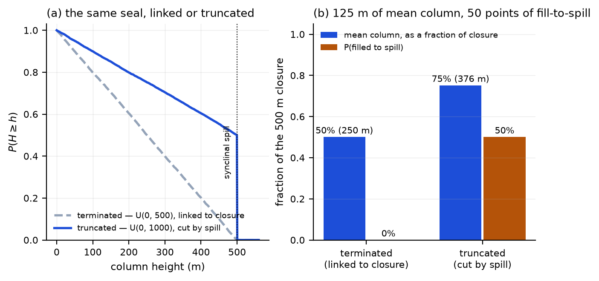
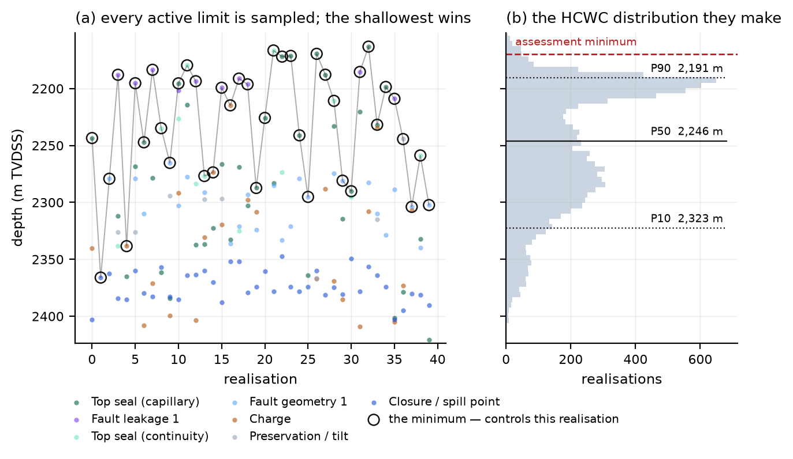
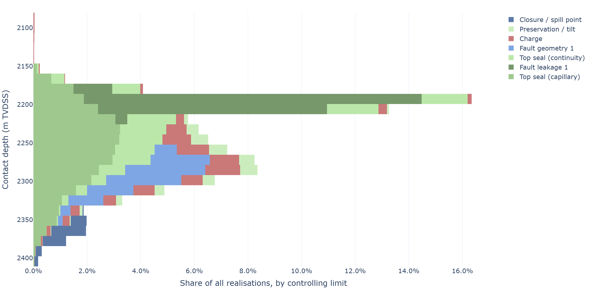
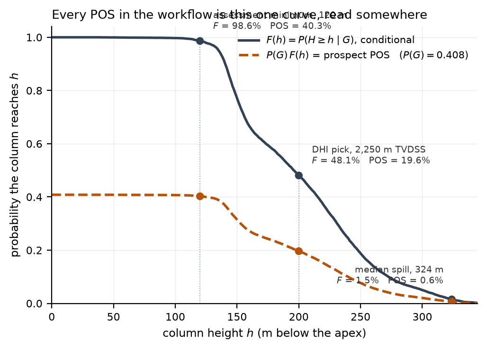
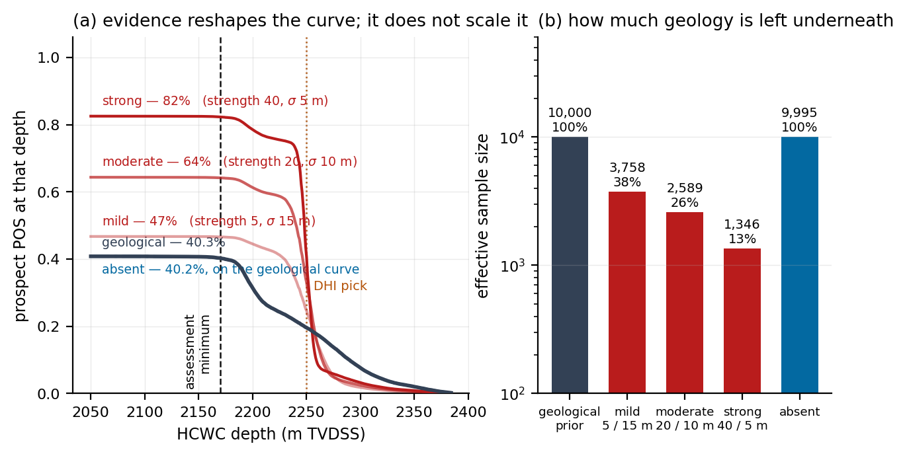

# Deriving hydrocarbon column-height distributions from competing geological limits and DHI evidence

### A stochastic and Bayesian framework for pre-drill prospect assessment

**Lars Hjelm**

---

## Abstract

Hydrocarbon column height is a major source of uncertainty in pre-drill prospect evaluation. It
affects in-place volume, hydrocarbon–water contact (HCWC) depth, and the probability that a well
encounters a significant accumulation. In many prospect evaluations, column-height uncertainty is
represented by specifying a generic probability distribution for the contact or column height
directly. Although practical, this approach obscures the geological mechanisms that limit the
accumulation, and it leaves the assessor unable to say what the distribution *means*.

Here a stochastic framework is presented in which column height is **derived from competing
geological limits rather than specified**. Potential limiting mechanisms — top-seal capillary
capacity, mechanical top-seal failure, structural spill, charge limitation, seal continuity and
fault-seal leakage — are represented explicitly as uncertain limits, each with its own probability
of being present. In every Monte Carlo realisation the shallowest active limit sets the maximum
column, and the identity of that limit is recorded. Repeating this produces both a distribution of
column height and, for each realisation, the mechanism that produced it.

The resulting distribution provides one common basis for HCWC prediction, depth-dependent
probability of success, volumetric assessment and mechanism-based uncertainty analysis. It also
provides a natural way to incorporate seismic evidence. Rather than substituting a deterministic
DHI case for the geological distribution, seismic observations are expressed as likelihood
functions over column height and used to reweight the geological realisations — a self-normalised
importance-sampling implementation of Bayes' rule that requires no re-simulation and leaves the
controlling-mechanism bookkeeping intact. The amplitude character updates the chance that the
elements worked and the picked geometry updates the column given that they did, so the prospect
chance at a threshold is the product of the two. On the worked prospect a mild anomaly raises
prospect POS from 40.3 % to 46.6 % and a strong one to 82.3 %, while the picked contact narrows
the P90–P10 spread of the contact from 132 m to 23 m; the effective sample size behind the update
— 10,000 realisations reduced to 3,758, or to 1,346 for a strongly stated interpretation —
measures how far the seismic evidence has displaced the geology.

An open-source implementation makes the workflow available for practical prospect evaluation
without requiring a three-dimensional geomodel.

---

## 1 · Introduction

Prediction of hydrocarbon column height is a central component of pre-drill prospect evaluation.
The assumed column influences both volumetric estimates and the probability that a well will
encounter hydrocarbons above a defined commercial threshold. Uncertainty in column height therefore
propagates directly into prospect volume, HCWC depth and probability of success (POS).

Despite this, column-height uncertainty is commonly represented by specifying a distribution of
possible HCWC depths or column heights directly. Such distributions may be based on analogue
fields, regional statistics, expert judgement, company policy, or some combination.

There is nothing inherently wrong with this. But it leaves one question unanswered:

> **What geological process is represented by the selected distribution?**

A hydrocarbon column does not have a probability distribution because "column height" is a
geological process. The maximum column is the outcome of one or more mechanisms capable of
terminating the accumulation. Depending on the setting these may include structural spill,
insufficient charge, capillary seal capacity, seal discontinuity, fault leakage, mechanical
top-seal failure, or post-charge processes.

This suggests a different question. Rather than asking

> What should the HCWC distribution be?

the assessment can ask

> **What geological mechanisms can stop the hydrocarbon column, and how uncertain is each?**

The column-height distribution then becomes an *output* of the geological model rather than an
input to it.

### 1.1 · What is established, and what is offered here

The competing-limits concept is not new. Beha *et al.* (2012) set out a general method for complex
traps in which several trapping elements must work simultaneously, by enumerating the discrete
scenarios and collapsing them onto a contact distribution. Hood (2019, 2024) states the stochastic
form directly — separate the background column-height distribution from the explicit geometric
limits, sample both, and take the minimum — together with the warning that blending them into a
single input distribution produces results that correspond to no geology. Grant (2020) reports
"column height control statistics" from Monte Carlo trap models. The engine described in §§2–4 is
that construction, and no novelty is claimed for it.

Four things in what follows do appear to be new, and are offered as the contribution:

1. **Per-element probability of success as a function of depth**, derived from the group-level
   minima rather than allocated by judgement, with a built-in identity test that the factorised
   depth-dependent POS reproduces the direct one (§5, §16.3). The test is what makes it a
   derivation rather than an assertion; it fails if the elements have been double-counted.
2. **Censoring-corrected calibration against empirical discovery data** (§7). Hood names the problem
   in words — a pool that filled to spill measures the trap, not the seal — but the statistical
   treatment does not appear to have been carried into the published column-height regressions.
3. **Recognition that column height and trap height share the apex pick**, so depth-conversion error
   manufactures a correlation between them that censoring alone cannot remove (§7).
4. **A likelihood formulation of DHI evidence over column height** — a detection function multiplied
   by a pick likelihood, reweighting the geological realisations with the argmin bookkeeping intact
   (§§9–15). Hood's own recommendation is the scenario switch, which is honest but discards
   information: it cannot narrow the distribution, cannot report which mechanism controlled the
   contact given the DHI, and yields no depth-dependent risk.

   The claim needs one boundary drawn around it. Monigle *et al.* (2025) integrate a DHI score with
   a geological prior by exactly the Bayesian update used here for the character channel, and they
   use an absent anomaly as negative evidence — so neither the update nor the treatment of absence
   is new. What does not appear in that work, or any other located, is the likelihood defined
   **over column height**, which is what makes the evidence reshape the contact distribution and
   the depth-dependent risk rather than only the chance. If that has been demonstrated elsewhere,
   the reference would be welcome.

An earlier draft offered a fifth item, a ceiling on the seismic validity term at the amplitude-
updated chance of hydrocarbons. It is withdrawn. The realisations the term weights are drawn
conditional on hydrocarbons being present, so the term is a conditional judgement and the ceiling
put the chance of hydrocarbons inside a factor that already assumed it (§10.2, §14.1).

---

## 2 · Column height as the outcome of competing limits

Consider a prospect in which several geological mechanisms may limit the hydrocarbon column. For a
given realisation let $H_\text{charge}$ be the maximum column supported by charge, $H_\text{spill}$
the structural spill limit, $H_\text{seal}$ the limit imposed by capillary seal capacity,
$H_\text{continuity}$ that associated with seal continuity, $H_\text{fault}$ that associated with
fault or lateral seal, and $H_\text{mech}$ that associated with mechanical top-seal failure.

The resulting column height is

$$H = \min\left(H_\text{charge},\, H_\text{spill},\, H_\text{seal},\, H_\text{continuity},\, H_\text{fault},\, H_\text{mech},\, \ldots\right)$$

Only mechanisms **active** in that particular realisation enter the minimum. Each mechanism
therefore carries two separate uncertainties: whether it is present at all, and — given that it is
— where it bites.

This formulation has a specific geological interpretation. A realisation does not contain a
weighted average of several possible leak points. It represents one possible geological history, in
which the first effective limiting mechanism determines the maximum column. Repeating the
calculation over many realisations generates the distribution of possible column heights.

At least one limit must always be present, since every closure has a spill point; without that
constraint some realisations have no active limit and an undefined column height.

---

## 3 · Geological mechanisms

The individual limits should be defined in terms of geological processes rather than as arbitrary
statistical distributions. Two conventions matter. A **capacity** — what a seal can hold, what a
fault will leak past — is naturally stated in metres of column below the apex and does not move
when the apex pick moves. A **mapped surface** — spill point, juxtaposition window, pinch-out — is
naturally stated as a depth. Forcing both into one convention makes the elicitation awkward in both
directions; the conversion from depth to column height uses the apex drawn in the same realisation.

That conversion is also where a known bias enters, and §7 returns to it:
$H = z_\text{limit} - z_\text{apex}$ subtracts two picks from the same depth-converted
surface.

### 3.1 · Structural spill

Structural spill represents the maximum column the trap geometry can retain. Uncertainty arises
from depth conversion, seismic interpretation, closure geometry, spill-point interpretation, fault
geometry, and pinch-out or truncation geometry. Structural spill is therefore itself a
distribution, not a fixed depth.

### 3.2 · Charge limitation

Charge limits the column when the available petroleum charge is insufficient to fill the trap to a
deeper limit. This can reflect uncertainty in source-rock presence and quality, maturity,
generation and expulsion, migration efficiency, carrier access, timing and phase behaviour.

An important distinction is that insufficient charge should not automatically be represented as an
HCWC at the base of the structure. If sufficient charge is available to fill the structure, charge
imposes no contact at all. Charge is therefore naturally a *competing* mechanism that may or may
not become the controlling limit — and one whose column-height distribution can be computed from an
area–depth integration rather than elicited.

### 3.3 · Capillary seal capacity

Capillary seal capacity provides another possible maximum column. In a Schowalter-type
formulation,

$$h_\text{max} = \frac{2\gamma\cos\theta}{g\,\Delta\rho}\left(\frac{1}{r} - \frac{1}{R}\right)$$

where $r$ is an effective seal pore-throat radius and $R$ the reservoir pore scale; the second term
is the reservoir's own entry pressure, which only the *difference* must overcome.

Two points matter for prospect assessment. Capacity is uncertain, and it is dominated by the
pore-throat radius, since $P_c \propto 1/r$. And capacity is **phase dependent**: the density
contrast $\Delta\rho$ means the same seal supports a much shorter gas column than an oil one, so
the charge phase and the seal fluid must be set coherently or the resulting contact belongs to no
prospect.

Two unit conversions in this expression fail upward and are worth stating explicitly. Converting
interfacial tension from dyne/cm by dividing by 100 rather than multiplying by $10^{-3}$ makes the
entry pressure ten times too large; omitting $g$ from the buoyancy balance compounds it to a factor
of 98. Both produce plausible-looking column heights in the hundreds of metres.

### 3.4 · Seal continuity

Seal continuity is a different failure mechanism from capillary breakthrough. A seal may have ample
local capillary capacity while being ineffective because of sand-filled channels, erosional
windows, depositional discontinuities, stratigraphic breaches or local thinning. It therefore
produces a limit that a single capacity distribution cannot capture, and it belongs in the model as
its own mechanism with its own probability of presence.

### 3.5 · Fault seal

Fault-bounded traps introduce further limits. The relevant controls include juxtaposition, shale
gouge ratio, fault-rock properties, membrane seal, fault-zone architecture, reactivation and
discrete leak points along the fault. Fault *geometry* and fault *leakage* are different failure
mechanisms even where they sit on the same fault, and are treated as separate limits belonging to
different risk elements.

Again the objective is not to assign an arbitrary "fault-seal HCWC distribution" but to represent
the process that generates a limiting depth.

### 3.6 · Mechanical top-seal failure

In sufficiently overpressured systems, mechanical failure of the top seal provides an additional
upper limit. Following Grant (2020), the supportable column is

$$H = \frac{S_{H\min} - P_p}{\text{grad}_w - \text{grad}_h}$$

the headroom between the minimum horizontal stress and the pore pressure, divided by the difference
in fluid gradients. This differs fundamentally from capillary breakthrough: the limiting condition
is rock failure under stress, not pore-throat entry pressure. Its applicability is conditional on
the pressure and stress state, which is why it enters as a mechanism with a probability of presence
rather than as a term in a blended distribution.

---

## 4 · Monte Carlo implementation

For each realisation $j$:

1. Sample the uncertain geological parameters, including the apex depth.
2. Determine which limiting mechanisms are active.
3. Calculate the limiting column height associated with each active mechanism.
4. Select the minimum active limit.
5. **Record both the resulting column height and the controlling mechanism.**

The output is therefore not $H_1, H_2, \ldots, H_N$ but the pairs $(H_j, M_j)$, where $M_j$ is the
mechanism controlling realisation $j$. The probability that mechanism $i$ controls the column is

$$P(M = i) = \frac{N_i}{N}$$

This bookkeeping costs one integer array per realisation and is the point of the whole
construction. It distinguishes a mechanism that is *uncertain* from one that is *controlling* —
which is a different question, and the one that should drive further work.

Sampling is performed through each limit's quantile function, so correlation between mechanisms
becomes a question of where the uniform draws come from. A Gaussian copula upstream, with a rank
correlation stated by the assessor and converted to the copula parameter, handles that without any
limit definition needing to know about it. Mechanism *presence* is drawn independently; §17 returns
to this.

---

## 5 · The column-height survival function

The primary output is the probability that the column reaches at least a specified height:

$$F(h) = P(H \geq h \mid G)$$

conditional on $G$, the event that the geological risk elements — charge, reservoir, closure,
retention — have all worked. This conditioning is not a technicality. A reservoir that is not there
has no contact to distribute, so every probability the engine returns is conditional on $G$.

The survival function provides one common representation of several quantities that are usually
treated separately.

**Hydrocarbon–water contact.** If the apex is at $z_\text{apex}$, then
$z_\text{HCWC} = z_\text{apex} + H$.

**Probability of reaching a given depth.** For a reservoir entry depth $z$, the chance the column
reaches it is $P(G)\,F(z - z_\text{apex})$.

**Probability of commercial success.** If $h_\min$ is the minimum column required for the discovery
or commercial criterion,

$$\text{Prospect POS} = P(G) \times F(h_\min)$$

with $P(G)$ the product of the element chances.

**Both terms are necessary and the omission is consequential.** Reporting $F(h_\min)$ alone
overstates the prospect by a factor of $1/P(G)$ — on the worked example below, by a factor of 2.5.
The two terms answer different questions: $P(G)$ asks whether there is an accumulation at all,
$F(h_\min)$ asks whether it is big enough to count.

The conceptual simplification is nonetheless real. **POS is not a separate distribution from column
height; it is a point on the column-height curve.** Consequently, changes in the HCWC distribution
propagate automatically into depth-dependent risk and into volumetrics, and there is no separate
reconciliation step because there were never two objects to reconcile.

A practical consequence: realisations below $h_\min$ must be *flagged* rather than filtered out.
They are failures, but they belong to the same sample as the successes, and removing them makes
$F(h)$ and the contact distribution impossible to read off the same object.

---

## 6 · Why the competing-limit formulation differs from blended distributions

An individual mechanism may have a broad distribution of possible limiting depths. Combining
several such distributions by blending or weighted averaging produces a distribution that
corresponds to no particular geological realisation.

Consider two limits, $H_A \sim f_A(h)$ and $H_B \sim f_B(h)$. The competing-limit result is

$$H = \min(H_A, H_B)$$

not a weighted combination of $H_A$ and $H_B$. The distinction matters most when a mechanism
represents leakage. Merging a leak into a background column-height distribution suppresses
realisations *above* the leak, which is not what a leak does — and Hood (2019) reports the
consequence that prospect volumes can *increase* when a deep leak is added, because the weighting
erroneously reduces the number of realisations above the geometric spill depth.

### 6.1 · Truncating, not terminating

A related and more common construction error concerns how a column-height distribution meets the
spill point. **Terminating** the distribution at spill — defining it over $(0, \text{closure})$ —
changes the relative distribution of *smaller* columns as well, and assigns essentially zero
probability to filling to spill, which asserts that the spill point exerts no control at all.
**Truncating** a background distribution by an independently sampled spill preserves the shape
below spill and produces filled-to-spill cases at a rate set by the seal capacity.

Figure 5 reproduces this in the engine on a 500 m closure with a uniform seal capacity. The
difference is 125 m of mean column and 50 percentage points of fill-to-spill, from a modelling
choice the assessor may not know they are making.

> **Figure 5.** The same seal capacity on the same 500 m closure, linked to closure height
> (terminated) or sampled independently and cut by spill (truncated). Terminating gives a mean
> column of 250 m and no chance of filling to spill; truncating gives 376 m and a 50 % chance. The
> vertical drop at 500 m in the truncated curve is the mode at spill — which, as Hood (2019) notes,
> should be an *output* of the simulation rather than a number the assessor supplies. Competing
> limits produce the truncated form by construction; the terminated form cannot be expressed,
> because no limit is parameterised by closure height.

---

## 7 · Calibration and QC against the empirical record

A column-height distribution that no one has checked against observation is an opinion. The
practical value of an empirical dataset is as a **QC step**: does the distribution this model
produced sit inside the range of columns actually found in comparable settings, and if not, which
mechanism is responsible?

Edmundson *et al.* (2021) compiled 242 Norwegian Continental Shelf discoveries with column height,
trap height, burial depth and trap-fill ratio, and released the table openly. This is the reference
used here. The QC question it answers is narrow but useful: for a closure of this height at this
burial depth, is the modelled P50 column plausible, and is the modelled probability of filling to
spill plausible?

Two properties of discovery data must be carried into that comparison rather than ignored.

**Filled-to-spill pools are right-censored.** In this dataset 111 of 242 discoveries — 45.9 % — are
filled to spill. Such a pool tells you that the seal could hold *at least* the trap height; it does
not measure what the seal could have held. Treating those points as exact measurements of seal
capacity biases the empirical relationship toward structural spill as the dominant control and
obscures the contribution of other mechanisms. Dropping them is not a remedy: it trades censoring
bias for truncation bias, conditioning on capacity being less than trap height, which manufactures
a positive relationship a second way. Fitting by maximum likelihood with the censoring modelled
recovers the underlying relationship.

**Column height and trap height share the apex pick.** Both are measured downward from the same
depth-converted surface, so an error in the apex propagates into both with opposite sign. This
manufactures correlation between them that no censoring correction can remove, because it is an
errors-in-variables problem rather than a selection problem.

The implication is not that a corrected relationship is the "true" geological model. It is that the
benchmark curve a prospect is judged against depends on the statistical treatment of the
observations, and that a comparison drawn without stating which treatment was used is not a
comparison. The practical instruction is simply: **plot the modelled distribution against the
record, state how the record was treated, and explain any material disagreement in terms of a
mechanism.** A modelled fill-to-spill probability far from the observed rate for closures of that
size is a finding about the spill and seal inputs, not a nuisance.

---

## 8 · A worked prospect

The implementation ships with a worked prospect: a faulted closure with its apex near 2,050 m
TVDSS, spill near 2,372 m, a computed charge fill and a computed top-seal capacity, together with
fault geometry, fault leakage, seal continuity and preservation limits. Element chances are charge
0.90, closure 1.00, reservoir 0.63 and retention 0.72, giving $P(G) = 0.408$. The assessment
minimum is 120 m of column. All results below are 10,000 realisations — the implementation's own
default, so a reader can reproduce them.

> **Figure 1.** (a) Forty consecutive realisations. Each coloured dot is one limit's sampled depth
> in that realisation; the ringed dot is the minimum, which controls it. Note that no limit wins
> consistently, and that the winner changes from realisation to realisation as the sampled depths
> reorder. (b) The HCWC distribution those minima make: P90 2,190 m, P50 2,247 m, P10 2,324 m. The
> shape is an output; nothing about it was elicited. Panel (a) is clipped for legibility — a few
> capillary capacities sample well below the plotted range.

Reading the geological result:

| | |
|---|---:|
| $P(G)$, element product | 0.408 |
| $F(h_\min)$ at 120 m | 0.986 |
| **Prospect POS** | **40.3 %** |
| HCWC P90 / P50 / P10 | 2,190 / 2,247 / 2,324 m |
| P(filled to spill) | 3.4 % |

The fill-to-spill probability is a derived number, not an input: it is the share of realisations in
which the spill point provided the minimum.

> **Figure 2.** (a) The controlling-limit histogram: top-seal capillary capacity controls 33.3 % of
> realisations, fault leakage 23.1 %, seal continuity 15.1 %, fault geometry 12.7 %, charge 7.7 %,
> preservation 4.6 % and spill 3.4 %. (b) The same information as a function of depth. The
> controlling share is **not constant down the structure**: shallow contacts are almost entirely
> seal-controlled, while deeper ones pass to fault geometry and finally to spill. This is the
> diagnostic that a distribution alone cannot provide.

The mechanism diagnostic changes what sensitivity analysis is for. The conventional question is
*which input is uncertain?* The useful question is *which uncertain mechanism actually controls the
result?* Here, refining the preservation model would move very little, because it controls 4.6 % of
realisations; refining the seal-capacity elicitation would move a great deal.

At the same time, a mechanism with a small overall share is not necessarily unimportant: Figure 2b
shows fault geometry controlling a large fraction of the *deep* realisations, which are exactly the
ones that carry the volume. Both readings come from the same array.

> **Figure 3.** One curve, read in three places. The solid curve is $F(h)$, conditional on the
> elements working; the dashed curve is $P(G)F(h)$, the prospect POS. At the 120 m assessment
> minimum, $F = 98.6\%$ and POS $= 40.3\%$. At the DHI-indicated column,
> $F = 48.1\%$ and POS $= 19.6\%$. Because $F$ decreases,
> $F(h_\min) \geq F(h_\text{DHI})$ always — the two numbers were
> never competing, and quoting one without stating the $h$ it was read at is the error the
> construction removes.

---

## 9 · Incorporating seismic evidence

Seismic observations provide additional evidence about hydrocarbon column height. The common
approach is to define a separate "DHI case" and substitute its contact depth, or its volume, for
the geological result. This is convenient, and it has a real virtue — it merges late rather than
contaminating the geological input distribution. But it treats the seismic interpretation as a
*scenario* rather than as *evidence*.

The general formulation is Bayesian updating. Let the geological Monte Carlo realisations represent
the prior $P(H)$, and let $D$ be the seismic observation. Then

$$P(H \mid D) \propto P(D \mid H)\,P(H)$$

Because the realisations **are** a sample from the prior, the posterior is that same sample with
weights:

$$w_j \propto P(D \mid H_j)$$

normalised to sum to one. This is self-normalised importance sampling, and it is not an
approximation to a Bayesian update — for this sample it *is* one. No new simulation is required.

Two consequences follow, and both matter more than the computational convenience.

**The mechanism information survives.** Each realisation still carries its controlling limit, so
the model can be asked which mechanism controls the contact *given the DHI* — a question the
scenario switch cannot answer at all, because its DHI branch has no mechanism attached.

**Prior and posterior are the same realisations.** $F_\text{prior}(h)$ and $F_\text{post}(h)$ are
therefore guaranteed to be comparable, which is what makes the change in the answer readable rather
than merely visible.

One boundary has to be drawn before anything is multiplied. The realisations are drawn from
$p(h \mid G)$: every one of them assumes the geological elements worked. A likelihood applied to
them can therefore only redistribute probability *within* $G$; it cannot say anything about
whether $G$ holds. That question is answered separately, by the amplitude character (§10), and the
prospect chance at a threshold is the product of the two answers:

$$\text{POS}(h_\min) = P(G \mid \text{character}) \times P(h \geq h_\min \mid G, \text{geometry})$$

The first factor is the element product updated by a likelihood ratio on the amplitude; the second
is read off the reweighted realisations. Each piece of evidence enters once, in the factor it is
evidence about, and the depth curve $P(G \mid \text{character}) \times F_\text{post}(h)$ passes
through the headline at $h_\min$ by identity.

---

## 10 · Seismic geometry and seismic character

A seismic observation carries two conceptually different kinds of information, and collapsing them
into one "DHI factor" is why teams argue about a single number that is doing two jobs.

**Geometry.** The interpreted position of a flat event and its uncertainty — pick error plus depth
conversion, the second usually larger — say where the column may terminate. This constrains $H$.

**Character.** Amplitude, polarity, conformity, AVO behaviour and consistency with the expected
fluid response say whether the event is consistent with hydrocarbons at all. This constrains
whether there is an accumulation.

The two channels can be separated experimentally by making one uninformative. On the worked
prospect, with the pick deliberately vague ($\sigma = 200$ m) so that geometry says nothing:

| | prospect POS | contact P50 | P90–P10 | ESS |
|---|---:|---:|---:|---:|
| geological prior | 40.3 % | 2,247 m | 132 m | 10,000 |
| character only — strength 40, $\sigma$ 200 m | **81.5 %** | **2,247 m** | 130 m | 9,994 |
| geometry only — neutral character, $\sigma$ 5 m | 40.7 % | 2,250 m | **23 m** | 1,346 |
| both — strength 40, $\sigma$ 5 m | 82.3 % | 2,250 m | **23 m** | 1,346 |

**Character moves the chance and leaves the depth alone**: POS rises from 40.3 % to 81.5 % while
the P50 contact does not move, the spread is unchanged, and the effective sample size stays at
essentially all 10,000 realisations — nothing has been reweighted. The small residual comes from
the 200 m pick, which is not quite uninformative.

**Geometry reshapes the distribution.** On this prospect it barely moves the median, because the
pick at 2,250 m happens to sit almost exactly on the geological P50 of 2,247 m; there is nothing
for it to shift. What it does instead is *narrow* — 132 m to 23 m — at the cost of four fifths of
the effective sample. It moves the chance by less than half a point, and that too is a property of
the example: the assessment minimum is 120 m of column and the pick sits 200 m below the apex, so
almost every realisation clears the minimum before and after. On a prospect whose minimum fell
inside the range of columns the pick favours, the same narrowing would move the chance; on one
whose pick sat away from the prior median it would move the median too.

The separation is structural rather than a property of the example. Character acts on
$P(G)$; geometry acts on the contact distribution, and the chance at any threshold is read off
that distribution. Anything that reshapes the curve moves every number read from it, which is why
"one affects POS, the other affects depth" is the wrong summary even though the table looks like
one.

### 10.1 · What the geophysicist has to supply

Three quantities, all already held as opinions:

1. **The depth of the interpreted event and its uncertainty.** Pick error plus depth conversion,
   and the second is usually the larger.
2. **Whether the picked event is the contact at all** — written $c$ below, and the subject of
   §10.2. A flat event can be lithology, a diagenetic front, fizz gas read as pay, or a
   processing artefact.
3. **A detection function $D(h)$** — the chance a column of height $h$ produces a mappable anomaly.
   Near zero below tuning thickness, rising through the resolution limit, then flat below one. The
   ceiling is deliberately below unity: even a thick column can fail to show, and a detection
   function reaching certainty would make an absent anomaly infinitely strong evidence.

The logistic form of $D(h)$ is a modelling choice, not physics. A Class III sand can become *less*
visible when very thick as the top and base responses separate, which is a humped function rather
than a monotone one. The function is therefore exposed as an input.

No new risk numbers are required, and the geological model is not re-run.

### 10.2 · The second question is not the first one restated

It is tempting to derive (2) from the amplitude. If the anomaly is bright and conformable, surely
the event bounding it is likely to be the contact? The temptation is worth resisting, and the
reason is a split that Monigle *et al.* (2025) draw explicitly.

Their five DHI attributes fall into two groups. **Body attributes** — anomaly strength, lateral
amplitude contrast — argue about whether hydrocarbons are present. **Contact attributes** — fit to
structure, amplitude terminations, presence of a fluid contact reflection — argue about whether the
picked event is the base of the column. The first group is what a strength or DHI-quality score
grades. The second is $c$.

They are positively dependent, because both improve with impedance contrast and data quality. They
are not the same judgement, and either can be good while the other is poor:

| | |
|---|---|
| bright, high-contrast body with a ragged, non-conformable termination | high R, low $c$ |
| dim body with a flat, conformable event that cuts structure | low R, high $c$ |

That second row is the case worth protecting. A conformable flat spot on a low-contrast reservoir
is an excellent contact indicator with an unremarkable amplitude, and any mapping from the
amplitude to $c$ makes it unsayable.

**The mapping to avoid is the obvious one.** Setting $c = R/(R+1)$ looks like a natural
conversion of a likelihood ratio to a probability. It is not one: it is the posterior from an
*even* prior, and it is a function of the body attributes, which are the wrong attributes. The
term $c$ is conditional on hydrocarbons being present — every realisation it weights was drawn on
that assumption — so it carries no chance of hydrocarbons at all, and no expression built from the
amplitude strength can supply it. The amplitude's evidence about hydrocarbons enters the other
factor, once, through $R$ (§9).

An earlier draft went further and bounded $c$ above by $P(G \mid \text{amplitude})$, on the
argument that a hydrocarbon–water contact requires hydrocarbons. The argument confused the two
factors: the bound put $P(G)$ inside a term already conditional on $G$, and with the bound in
place the amplitude strength reached the contact distribution as well as the chance, moving the
posterior median by 17 m on the worked prospect with $c$ held fixed. The bound is withdrawn. What
the amplitude can honestly do for $c$ is flag disagreement — the two rows above are unusual enough
to be worth stating in a report — rather than supply the number.

### 10.3 · When the detection function is worth arguing about

It would be easy to read the above as though both inputs matter equally everywhere. They do not,
and it is worth being specific about when the second one earns the effort.

For a **seen** anomaly, the detection function does much less than its prominence suggests. On the
worked prospect, holding everything else fixed, replacing $D(h)$ with a constant does not move the
exceedance curve at all: with a detection midpoint of 25 m and an assessment minimum of 120 m,
every realisation that can count sits on the function's ceiling, and a constant factor cancels in
the normalisation. Even where $D(h)$ does vary across the columns in play, a pick sharper than the
detection function concentrates the posterior into a band over which $D(h)$ is near enough
constant to cancel.

**The likelihood floor does more.** Dropping $L \geq 1 - c$ instead moves the same curve by up to
seven points of exceedance at $c = 0.70$. That comparison is worth stating because the intuition
runs the other way: the detection function is the novel-looking term, and the floor looks like a
safety rail. On any prospect where the interpreter is less than certain the picked event is a
contact, the floor is the term doing the work, and §14.1 is why.

The detection function becomes decisive in two circumstances, and both are recognisable in
advance.

**When the anomaly is absent.** There is then no pick to carry the update, and $1 - D(h)$ is the
entire likelihood. Section 12 is that case.

**When the detection threshold falls inside the range of columns the pick favours.** The shipped
prospect has a P50 column of 196 m against a detection midpoint of 25 m, so every column under
discussion is comfortably detectable and the function has nothing to discriminate. Move that
midpoint to 250 m — a thin, poorly imaged reservoir where only an unusually tall column would show
— and it becomes the dominant term, worth up to 27 points of exceedance. The direction is the one
worth holding on to: if only a tall column could have been seen, then having seen one is evidence
that the column is tall, so accounting for detectability *raises* the answer rather than
discounting it.

The practical reading: on a thick, well-imaged prospect with a confident pick, the answer does not
notice $D(h)$. On a thin prospect near the limit of resolution, or on any prospect where the
anomaly is absent, it is the input that decides the result. In every case, $c$ is the input to
check first.

---

## 11 · Evidence reshapes the distribution rather than scaling it

One consequence of likelihood-based updating is that seismic evidence does not act as a
multiplicative correction to POS. It changes the *shape* of the column-height distribution.

> **Figure 4.** (a) Prospect POS against depth, for the geological prior, for three seismic
> observations at a picked contact of 2,250 m and for an absent anomaly. The curves do not merely lift: each develops a step
> at the pick, because the evidence moves probability toward the depths the interpreted event
> supports and away from those it argues against. (b) The effective sample size behind each update.
> A strongly stated interpretation leaves 1,346 of 10,000 realisations carrying the answer.

Read as depth-dependent risk, on the worked prospect with a mild anomaly, the curve being
$P(G \mid \text{character}) \times F(h)$ in both columns:

| chance the contact reaches | geological | given the DHI |
|---|---:|---:|
| 2,150 m | 40.7 % | 46.7 % |
| 2,200 m | 31.5 % | **44.5 %** |
| 2,250 m | 19.6 % | 24.8 % |
| 2,300 m | 7.7 % | **1.8 %** |

The chance at 2,200 m rises by thirteen points while the chance at 2,300 m falls by six. **A
single POS multiplier cannot express that**, and neither can a scenario switch: both would move
$P(\text{success})$ without specifying how $P(H \geq h)$ changes as a function of $h$. A likelihood
defined on column height does both, and this is the direct connection between seismic
interpretation and depth-dependent prospect risk.

The distribution also **narrows** — from a 132 m P90–P10 spread to 56 m at the mild setting and
23 m at the strong one. Evidence is supposed to sharpen an estimate as well as move it, and a
scenario switch, which mixes two branches, can only broaden.

---

## 12 · Absence as evidence

The detection function is what lets an *absent* anomaly enter the update at all. If a column of
height $h$ should have produced a mappable anomaly and none is present, the likelihood is
$1 - D(h)$, which is largest at small $h$. No special handling is required — absence enters the
same machinery as presence.

What that machinery can do with it is bounded by §9. The realisations are conditional on $G$, so
$1 - D(h)$ redistributes probability among column heights and says nothing about whether there
are hydrocarbons. On the worked prospect the redistribution is nil: with a detection midpoint of
25 m every column above the 120 m assessment minimum sits on the function's ceiling, the weights
are flat to within rounding, and prospect POS stays at 40.2 % on an effective sample of 9,995.
Move the midpoint to 150 m, a reservoir near the limit of resolution, and absence does what the
formulation promises within $G$: the median contact shallows from 2,247 m to 2,197 m, the
effective sample falls to 5,233, and the chance moves by little because the minimum is small.

An earlier draft reported a fall from 40.3 % to 6.3 % on the default prospect. That number came
from applying a ratio between two column heights inside $G$ as if it were a likelihood ratio on
the prospect, and is withdrawn.

**The chance-axis route is published and is not implemented here.** Monigle *et al.* (2025) treat
an absent anomaly as a negative line of evidence within ExxonMobil's integrated chance-of-success
framework, and report a prospect carried from a geological 46 % to an integrated 8 % on that
basis; their own assessment is that the practice "is not consistently applied in industry". A
likelihood ratio on $G$ for an absent anomaly is
$P(\text{absent} \mid G) / P(\text{absent} \mid \neg G)$. The numerator is available — it is
$1 - D(h)$ averaged over the geological columns, 0.10 on the default prospect — but the
denominator is the chance that a barren trap shows no anomaly, which needs a false-positive rate
for bright events with no hydrocarbons behind them. The two-population strength model does not
carry that number, because "no anomaly" is not a reading on its axis. The implementation
therefore holds the character channel neutral when nothing is seen: an absent anomaly reshapes the
column and does not lower the chance. That is a limitation of the current formulation and is
listed as one in §17. A false-positive rate is an elicitable quantity, and adding it would close
the gap without changing anything else in the chain.

The narrower claim that survives is the column-height route. Where the detection threshold falls
inside the range of geological columns, absence reshapes the contact distribution toward the
short columns that would not have shown, and that reshaping is not available on the chance axis.

---

## 13 · Seismic uncertainty and the effective sample size

The influence of the seismic evidence depends on the stated uncertainty of the interpretation. A
broad likelihood leaves the geological prior substantial influence; a sharp one concentrates the
posterior on a narrow range of column heights, and the answer can become dominated by the seismic
observation.

**That is not a defect. With genuinely informative geophysics it is the correct outcome** — a
well-imaged, conformable flat spot at a confidently picked depth is better evidence about where the
contact sits than any elicited seal capacity, and a model that refused to let it win would be
wrong. The requirement is that the displacement be *visible* rather than discovered afterwards.

The diagnostic is Kish's effective sample size,

$$\text{ESS} = \frac{\left(\sum_i w_i\right)^2}{\sum_i w_i^2}$$

which reports how many of the original realisations the posterior effectively rests on:

| interpretation | prospect POS | contact P50 | P90–P10 | ESS |
|---|---:|---:|---:|---:|
| geological prior | 40.3 % | 2,247 m | 132 m | 10,000 |
| mild — strength 5, $\sigma$ 15 m | 46.6 % | 2,252 m | 56 m | 3,758 |
| moderate — strength 20, $\sigma$ 10 m | 64.2 % | 2,251 m | 40 m | 2,589 |
| strong — strength 40, $\sigma$ 5 m | 82.3 % | 2,250 m | 23 m | **1,346** |
| absent where one was expected | 40.2 % | 2,247 m | 132 m | 9,995 |

A low ESS does not mean the interpretation is wrong. It means the posterior depends heavily on it.
At 1,346 the answer rests on under a seventh of the geological realisations, and should be
presented as such. The number belongs beside the result, not in an appendix.

The ESS reports the geometry channel only. The character channel updates a single number and
throws no realisations away, which is why the chance can move from 40.3 % to 82.3 % on the strong
row while the ESS is the same as for a neutral character at the same pick (§10). The absent row
is the converse: nothing is reweighted because every column sits on the detection ceiling, and
nothing moves.

---

## 14 · What the evidence cannot override

Two constraints bound the update, and they are different in kind.

### 14.1 · The likelihood floor

The pick likelihood carries a floor, $L \geq 1 - c$, where $c$ is the chance that the picked
event is the hydrocarbon–water contact, given that there is hydrocarbon for it to be the contact
of. A flat event can be lithology, a diagenetic front, fizz gas read as pay, or a processing
artefact, and the floor is where that possibility lives. It is Cromwell's rule made operational:
a bounded pick shape would otherwise assign probability zero below its deepest bound, and no later
evidence can revive a zero.

**$c$ is conditional on $G$, and carries nothing else.** The realisations it weights were drawn
from $p(h \mid G)$, so the term is the contact-attribute judgement of §10.2 and no function of the
chance of hydrocarbons. An earlier draft multiplied it by $P(G \mid \text{amplitude})$ as a
ceiling; §10.2 records why that was withdrawn.

With $c = 0.70$ the floor sits at $0.30$, so **thirty per cent of the weight on every realisation
is untouchable by the pick**, however sharply it is drawn, and the depth channel can say at most
$0.70 / 0.30 = 2.3 : 1$ against any contact depth.

Its behaviour under a pick the geology considers implausible is instructive. Holding the character
strong (strength 40) and the pick sharp ($\sigma = 5$ m) and moving the picked contact progressively
deeper:

| picked contact | prospect POS | contact P50 | P90–P10 | ESS |
|---|---:|---:|---:|---:|
| 2,250 m — well supported | 82.3 % | 2,250 m | 23 m | 1,346 |
| 2,300 m | 82.3 % | 2,299 m | 59 m | 1,342 |
| 2,350 m | 82.0 % | 2,345 m | 155 m | 855 |
| 2,400 m | 81.5 % | 2,260 m | 200 m | 1,876 |
| 2,500 m — beyond all support | 81.4 % | **2,247 m** | 132 m | **10,000** |

The contact follows the pick while the geological model supports it, then **detaches**. At 2,350 m
the posterior median still follows, but the spread has opened from 23 m to 155 m and the
effective sample has fallen to 855: the pick is being carried by a thinning tail of realisations.
At 2,400 m the median has fallen back toward the prior, and at 2,500 m it is the prior exactly
with the effective sample size returned to 10,000 — the likelihood has become flat, so the
reweighting does nothing. The model has concluded *that is probably not a contact* rather than
*the contact is at 2,500 m*.

Note that the ESS is **not monotone**: it falls as the evidence sharpens against the prior, then
rises again as the floor takes over — 855 at 2,350 m, back to 10,000 at 2,500 m. That
non-monotonicity is the tell, and it is why ESS should be read alongside the answer rather than as
a quality score. Note also that POS stays at 81–82 % throughout, which is correct — the character
channel still reports a bright anomaly, and a bright anomaly is evidence for hydrocarbons even when
the interpreter has mislocated the contact. The one-point fall from 82.3 % to 81.4 % is the
geometry channel giving back the small share of realisations below the assessment minimum that
the well-supported pick had argued against.

### 14.2 · Attribution between risk elements

A fluid indicator senses whether a reservoir with hydrocarbons exists and, more weakly, what fluid
fills it. It does **not** identify which of charge, closure, reservoir or retention would otherwise
have failed.

The seismic update may therefore move the total chance and may move the contact, and it may **not**
re-attribute risk between elements. If the element chances came from a charge argument, a bright
spot does not retrospectively improve the charge argument. In the implementation the element
chances are set once, and nothing in the DHI workflow can edit them.

This is published practice rather than a local convention. Monigle *et al.* (2025) state it as
policy: geological risking must remain independent of the DHI attributes, and "the presence of a
DHI does not increase the chance of adequacy of source presence; the adequacy of source is
determined by considering the geologic factors alone."

This is also the practical guard against double counting. A DHI should not be read simultaneously
as independent evidence for charge, reservoir presence, seal quality and contact depth. The update
operates on the relevant geological variable — column height — and leaves the element probabilities
alone unless an explicit and defensible dependency model has been established. It is the difference
between using evidence and laundering it.

---

## 15 · Dependence between the two channels

Separating geometry from character raises an apparent further problem: the two observations are
not independent. A strong amplitude anomaly is more likely to produce a clearly mappable
termination than a weak one, and a naive account would multiply two likelihood ratios on the same
hypothesis and overstate the combined evidence.

Under §9 the problem does not arise in the arithmetic, because the two channels are not ratios on
the same hypothesis. The character channel is a likelihood ratio on $G$ and updates $P(G)$; the
geometry channel is a likelihood over $h$ within $G$ and updates $p(h \mid G)$. Each factor is
updated once by the evidence that bears on it, and the product is the chain rule, not an
independence assumption. An earlier draft blended the two ratios through an elicited dependence
parameter; that construction applied a ratio between column heights inside $G$ as if it were a
ratio on the prospect, and is withdrawn.

The dependence that remains is between the two *judgements*. Monigle *et al.* (2025) note that
body and contact attributes both improve with impedance contrast and data quality, so an assessor
who has graded the amplitude strongly is likely to grade the conformance strongly too. That is a
matter for the elicitation — the two rows of §10.2 are the cases where the judgements should
diverge — and not for the arithmetic, which cannot tell a correlated pair of honest judgements
from an uncorrelated one.

For scale, the one published measurement located for a comparable quantity: Kjønsberg *et al.*
(2010) inverted prestack AVO by Markov chain Monte Carlo at three locations offshore Norway and
reported prior and posterior hydrocarbon probabilities; the implied likelihood ratio at the
prospect centre was about **29**, and that location was subsequently drilled and found gas. Their
number carries the amplitude and the geometry together, since the fluid contacts are part of
what their chain samples, so it bounds the whole update rather than one channel. A careful
inversion on good data buys roughly a factor of thirty; the character channel here is bounded at
10 either way, after Simm, and the geometry channel at $c / (1 - c)$ against any depth. It is
worth knowing what the ceiling looks like before typing a number into a slider.

---

## 16 · Practical implications for prospect evaluation

### 16.1 · The contact distribution becomes traceable

Instead of storing only an HCWC P10/P50/P90, the assessment retains the mechanisms that produced
them. A reviewer can ask not only *why is P50 at this depth?* but *which mechanisms produce the
uncertainty around P50, and which produce the tails?*

### 16.2 · Sensitivity analysis becomes mechanism based

A mechanism that never controls the column cannot materially influence the distribution, whatever
its own uncertainty. This is a rational basis for prioritising further geological work, and it
routinely contradicts the intuition that the most uncertain input deserves the most attention.

### 16.3 · Risk and volume remain internally consistent

Because POS is derived from the same column-height distribution used for volumetrics, the risk
criterion and the volume distribution are linked by construction. Changing $h_\min$ changes POS
directly, from the same curve. The per-element depth curves are derived from the group-level minima
and tested against the direct calculation, so a discrepancy between the factorised and direct
depth-dependent POS is reported rather than absorbed.

### 16.4 · Seismic evidence updates the model instead of replacing it

A DHI need not be a separate deterministic case. It can reweight the existing realisations,
retaining both the geological uncertainty and the information in the seismic observation — and
retaining the mechanism attribution, so the question *which limit controls the contact given the
DHI* remains answerable.

### 16.5 · The assessment becomes auditable

Because each realisation retains its controlling mechanism and the inputs are explicit, the
distribution can be traced back to the assumptions that generated it. This matters most after
drilling. A dry hole or an unexpectedly small discovery can be evaluated in terms of the mechanism
that was misassessed, rather than by asking why an HCWC distribution was too deep.

---

## 17 · Limitations

The framework is deliberately simplified and is not a basin or reservoir simulator. Several
processes are not represented explicitly: hydrodynamic gradients; remigration and palaeo-contacts;
complex compartmentalisation; explicit three-dimensional fluid-flow simulation; and detailed
pressure-history modelling.

**Mechanism presence is drawn independently.** Limit *depths* can be correlated through the copula,
but whether a mechanism is present is an independent Bernoulli draw per limit. In settings where
the presence of one mechanism implies another — several faults sharing a reactivation history, for
instance — that independence is an assumption, and a strong one.

**Two-phase columns are handled through charge, not through seal capacity.** Where both a gas–oil
contact and an oil–water contact are controlled by capillary leak, a single top seal is in contact
with gas at the crest and oil on the flanks, and the two legs are limited by different entry
pressures. That construction is not implemented.

**Seismic likelihood functions are modelling assumptions unless calibrated.** The detection function
and the pick likelihood are elicited, not measured. This is why the effective sample size and the
sensitivity of the answer to each seismic input are reported: when a typed assumption moves the
contact further than the geology does, that is a finding about the assumptions.

**An absent anomaly does not lower the chance.** The formulation applies absence within $G$, where
it reshapes the column, and holds the character channel neutral because the strength model has
no reading for "nothing seen". The negative evidence on the chance that Monigle *et al.* (2025)
apply needs a false-positive rate for bright events with no hydrocarbons behind them, which is not
elicited here (§12). An assessor who wants absence to count against the prospect has to do so
outside the update.

These limitations do not invalidate the framework. They define the circumstances under which
additional modelling is required. The purpose is a transparent probabilistic representation of the
dominant column-limiting mechanisms during prospect evaluation, not a replacement for
petroleum-system or reservoir simulation.

---

## 18 · Discussion

The principal advantage is conceptual rather than computational. A directly elicited HCWC
distribution asks the assessor to specify the final uncertainty. The competing-limits approach asks
them to specify the geological mechanisms that produce it.

This matters because the mechanisms mean different things. Structural spill represents geometry.
Capillary capacity represents retention against buoyancy. Fault seal represents lateral
containment. Charge limitation represents petroleum-system uncertainty. Mechanical failure
represents a stress condition. Once each is represented as a competing limit, the HCWC distribution
becomes an emergent property of the model rather than an input to it.

The construction also separates *what is uncertain* from *what controls the outcome*. A mechanism
may carry considerable uncertainty and little influence, if it rarely provides the minimum;
conversely, a narrow uncertainty in a dominant mechanism can move the whole distribution. The
framework therefore provides not only a distribution but an explanation of it — which is what makes
it communicable between geoscientists and decision makers, and defensible under review.

The seismic extension follows the same principle. A DHI is not a distribution over the contact; it
is an *observation* of one. Turning it into a distribution and combining it with the geological
distribution treats evidence as a competing opinion, and that is where several common workflows go
wrong. Treating it as a likelihood over column height keeps it in its proper role, keeps the
geological model intact underneath, and — through the effective sample size — makes the extent of
its influence a reported number rather than an impression.

---

## 19 · Conclusions

A stochastic competing-limits framework provides an alternative to specifying hydrocarbon–water
contact or column-height distributions directly during pre-drill prospect assessment.

1. **Column height can be derived rather than specified.** The maximum column in each realisation is
   set by the shallowest active geological limit, and the distribution is the output.

2. **One distribution serves risk and volume.** HCWC depth, depth-dependent probability of success
   and commercial discovery probability are all readings of the same curve, with
   $\text{POS} = P(G) \times F(h_\min)$. Both terms are required; the conditional term alone
   overstates the prospect by $1/P(G)$.

3. **Controlling mechanisms can be identified explicitly.** Recording the argmin turns a
   distribution into a diagnostic of which geological uncertainties actually influence the
   assessment, and how that changes with depth.

4. **How the distribution meets the spill point is consequential.** Truncating a background
   distribution by an independently sampled spill preserves the shape below spill and produces
   filled-to-spill cases at a rate the seal implies; terminating it at spill does neither, and on a
   500 m closure the difference is 125 m of mean column.

5. **Empirical discovery data require care.** Filled-to-spill discoveries provide lower bounds on
   seal capacity, not measurements of it, and column height and trap height share the apex pick.
   The record remains the right QC reference provided its treatment is stated.

6. **Seismic evidence can be incorporated as evidence.** Likelihood weighting of the geological
   realisations is a Bayesian update that requires no re-simulation, preserves the mechanism
   attribution, and reshapes the depth-dependent risk rather than scaling it. The amplitude
   character updates the chance that the elements worked and the picked geometry updates the
   column given that they did; the prospect chance at a threshold is their product, and each
   piece of evidence enters once. The effective sample size reports how far the geometry has
   displaced the geology, and the likelihood floor ensures that a single interpretation can never
   rule the geology out.

7. **The assessment becomes auditable.** Rather than asking why a particular HCWC distribution was
   chosen, a reviewer can examine the mechanisms that generated it.

The objective is not a more sophisticated distribution for its own sake. It is to make the
distribution a consequence of explicit geological assumptions — so that it can be defended,
reviewed, and corrected after drilling.

An open-source implementation applies these concepts during prospect evaluation without requiring a
three-dimensional geomodel. It does not determine whether a prospect should be drilled. It provides
a transparent representation of one of the key uncertainties informing that decision.

---

## References

Beha, A., Christensen, J. E. & Young, R. (2012). A general method for the consistent volume
assessment of complex hydrocarbon traps. *Journal of Petroleum Geology* **35**(1), 85–98.

Edmundson, I., Davies, R., Frette, L. U., Mackie, S., Kavli, E. A., Rotevatn, A., Yielding, G. &
Dunbar, A. (2021). An empirical approach to estimating hydrocarbon column heights for improved
pre-drill volume prediction in hydrocarbon exploration. *AAPG Bulletin* **105**(12), 2381–2403.
doi:10.1306/03122119223. Data: https://osf.io/6ysbv/ (CC-BY 4.0).

Grant, N. T. (2020). Using Monte Carlo models to predict hydrocarbon column heights and to assess
the value of seal capacity data. *Petroleum Geoscience* **27**(2).

Hood, K. C. (2019). *Hydrocarbon column height.* Risk Coordinator Workshop #17, Houston,
14 November 2019. ExxonMobil Upstream Integrated Solutions.

Hood, K. C. (2024). *Hydrocarbon column heights*, Parts 1 and 2. Rose & Associates.

Kjønsberg, H., Hauge, R., Kolbjørnsen, O. & Buland, A. (2010). Bayesian Monte Carlo method for
seismic predrill prospect assessment. *Geophysics* **75**(2), O9–O19.

Monigle, P. W., Hedayati, T. S. & Goulding, F. J. (2025). Integrated and improved direct
hydrocarbon indicators: A step forward in petroleum risk discrimination. *AAPG Bulletin*
**109**(5), 617–636. doi:10.1306/04042524030.

Schowalter, T. T. (1979). Mechanics of secondary hydrocarbon migration and entrapment. *AAPG
Bulletin* **63**(5), 723–760.

---

*Figures 1–5 are generated by `scripts/paper_figures.py` from the implementation's own default
prospect at 10,000 realisations; the prospect definition is written alongside them as
`docs/figures/prospect.json`.*
