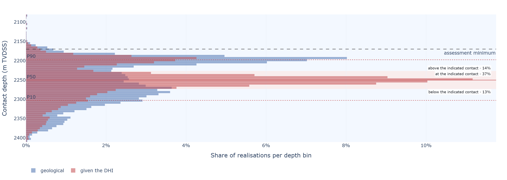

# Building hydrocarbon–water contact distributions from competing geological limits and DHI evidence

### A stochastic framework with probabilistic DHI updating for pre-drill prospect assessment

**Lars Hjelm**

---

*Every figure is an exhibit of the open-source implementation, exported unchanged by
`scripts/export_exhibits.py`; the caption names the tab it comes from. Every number is produced
by `scripts/paper_facts.py` from the shipped prospect at the settings stated. The method is set
out in full on tab 8.1 of the tool.*

## Abstract

Hydrocarbon–water contact (HCWC) depth is a major source of uncertainty in pre-drill prospect
evaluation and can affect in-place volume estimates by orders of magnitude. The complexity of the
processes controlling HCWC depth means that many assessments represent the uncertainty with a
generic distribution for contact depth or column height, based on analogue fields, regional
statistics, expert judgement, company standards, or a combination. This is practical. But a generic
distribution may over- or underestimate the potential of an individual prospect and hides which
geological mechanisms actually control the column.

Here, column-height uncertainty is derived from competing geological limits rather than specified
directly. Structural spill, charge limitation, top-seal capillary and mechanical capacity, seal
continuity, fault-seal leakage and reservoir pinch-out are represented as uncertain limits, each
with its probability of being active and its depth or capacity uncertainty. In each Monte Carlo
realisation, the shallowest active limit controls the column, and the controlling mechanism is
retained. The result is therefore both a column-height distribution and a record of what controls
it.

The same realisations provide the probability of reaching any column height or well depth, linking
HCWC uncertainty to depth-dependent probability of success and volumetrics without a separate
depth-risk elicitation.

Where seismic evidence indicates a possible HCWC, the DHI is treated as additional evidence rather
than as a deterministic contact. The DHI evidence index updates the probability of a
hydrocarbon-bearing accumulation, while the prospect-specific DHI geometry reweights the
conditional HCWC distribution. The resulting posterior is used for both HCWC prediction and
probability of success with depth.

An open-source application implements the workflow and provides the geological assumptions,
controlling mechanisms, DHI update and empirical benchmark in one assessment.

---

## 1 · Introduction

The assumed hydrocarbon column uncertainty propagates directly into prospect volume and probability
of well success. Despite its importance, HCWC is commonly represented by a distribution of possible
contact depths or column heights derived from analogue fields, regional statistics, expert
judgement, company policy, or some combination.

There is nothing inherently wrong with this approach. But it leaves a basic question unanswered:

> What geological process is represented by the selected distribution?

A hydrocarbon column is not a random variable in isolation. Its maximum extent is the outcome of
geological processes: structural spill, charge limitation, seal capacity, seal discontinuity, fault
leakage, reservoir geometry and, in some settings, post-charge processes.

A distribution can of course be derived from statistics of similar prospects. But is that
distribution appropriate for this prospect?

The alternative explored here is to represent the geological mechanisms that may limit the column
and let their competition generate the HCWC distribution. The distribution then becomes an output
of the geological model rather than an input. The same realisations also provide the probability of
reaching a given column height or absolute depth, linking HCWC uncertainty to depth-dependent
probability of success and well risk.

### 1.1 · From trapping elements to HCWC

The competing-limits concept is not new. Beha *et al.* (2012) described consistent volume assessment
of complex traps by considering combinations of trapping elements being present or failing and
deriving the resulting leak points. Hood (2019, 2024) described the stochastic treatment of column
height by sampling background column height and explicit geometric limits and taking the minimum.

The implementation used here follows the same geological principle, but represents the limiting
mechanisms as probabilistic depth or capacity distributions. Charge limitation, structural spill,
fault leakage, seal capacity and continuity, mechanical seal failure and reservoir geometry can
therefore compete within each Monte Carlo realisation.

The shallowest active limit controls the column. The model retains that controlling mechanism, so
the result is not only a distribution of HCWC depths but also a record of what controls the column
and how that control changes with depth.

This is important for risking. The uncertainty is not only described; it is linked to a geological
mechanism that can be examined, challenged or potentially reduced with additional information.

### 1.2 · Incorporating DHI evidence

A DHI provides a different type of information. Its seismic character may provide evidence for
hydrocarbon presence, while its geometry may provide information about the position of the HCWC.

These are treated separately.

The DHI evidence index provides an evidence weight for the hydrocarbon-bearing state:

$$LR(s)=\frac{f(s\mid HC)}{f(s\mid NoHC)}$$

where $s$ is a conceptual DHI evidence index. Combined with the geological accumulation probability
$P(G)$, this gives an updated probability:

$$P(G\mid s)= \frac{LR(s)\,P(G)}{LR(s)\,P(G)+(1-P(G))}$$

The index is relative rather than physical: zero represents neutral evidence, positive values
increasingly positive evidence, and negative values increasingly negative evidence.

The prospect-specific DHI geometry is treated separately as evidence on column height. The
geological HCWC realisations are reweighted according to the likelihood of observing the DHI
geometry for each possible column height:

$$P(H\geq h\mid G,\,DHI)$$

The result is an updated HCWC distribution rather than a deterministic contact placed at the DHI
depth.

This distinction matters. A strong DHI may provide strong evidence for hydrocarbons while the HCWC
remains uncertain because of depth conversion, contact attribution, pick uncertainty or the
possibility that the seismic response is not a contact. Conversely, a deep DHI may support
hydrocarbon presence while still giving a relatively low probability that the column reaches the
minimum required at a particular well.

The same posterior realisations are then used to calculate the probability of reaching any depth.
The DHI therefore affects both the probability of an accumulation and the distribution of where the
hydrocarbon column may terminate, without creating a separate depth-risk model.

### 1.3 · Scope and contribution

The competing geological limits used here are established concepts rather than a new risking
principle. The aim is to combine them in a practical workflow in which geological assumptions
generate the HCWC distribution and the controlling mechanism is retained for each realisation.

The main focus is the integration of DHI evidence with that geological HCWC distribution. DHI
evidence strength updates the accumulation probability, while prospect-specific DHI geometry
updates the conditional HCWC distribution. The resulting posterior provides a common basis for HCWC
prediction, controlling-mechanism analysis and probability of success with depth.

Empirical column-height data are used as a supporting benchmark rather than as a replacement for
prospect-specific geological reasoning. The application is intended to make the assumptions behind
HCWC uncertainty explicit, traceable and testable.

---

## 2 · Column height as the outcome of competing limits

Consider a prospect in which several geological mechanisms may limit the hydrocarbon column. For a
given realisation let $H_\text{charge}$, $H_\text{spill}$, $H_\text{seal}$, $H_\text{continuity}$,
$H_\text{fault}$ and $H_\text{mech}$ be the maximum columns consistent with charge, structural
spill, capillary seal capacity, seal continuity, fault or lateral seal, and mechanical top-seal
failure.

The resulting column height is

$$H = \min\left(H_\text{charge},\,H_\text{spill},\,H_\text{seal},\,H_\text{continuity},\,H_\text{fault},\,H_\text{mech},\,\ldots\right)$$

Only mechanisms active in that realisation enter the minimum, so each carries two separate
uncertainties: whether it is active as a limit, and, given that it is, where it bites. An inactive
mechanism can simply be represented as having no finite limiting height.

A realisation does not contain a weighted average of several possible leak points. It is one
possible geological configuration, in which the first effective limiting mechanism determines the
maximum column. Repeating this over many realisations generates the HCWC distribution and the
statistics of which mechanism controls it.

This is also why a potential leak should not simply be blended into a background column-height
distribution. A leak changes the outcome only for realisations that reach the leak; it should not
reduce the probability of shallower columns. The competing-limit formulation does this by
construction: the background capacity and the geometric limit are sampled separately, and the
minimum is taken for each realisation. Hood (2019) illustrates the same problem, including cases
where representing a deep leak by reweighting the background distribution can produce the
counter-intuitive result of increasing prospect volume.

> **Figure 1.** The limiting mechanisms for the worked prospect shown on a common column-height
> axis (tab 3.1 of the implementation). The HCWC distribution results from taking the minimum of
> the active limits in each realisation. The plotted limit curves show the corresponding sampled
> constraints; the resulting contact is their realised minimum. No curve is elicited as an HCWC
> distribution.

A limit is not necessarily a leak point. Some limits represent an actual escape path, such as
structural spill, fault leakage or seal failure. Others limit the column without hydrocarbons
necessarily leaving the trap: charge may be insufficient to fill higher, or reservoir continuity may
terminate the connected pore volume. In all cases the relevant quantity is the maximum column that
can be supported in that realisation.

The distinction is about connectivity rather than the statistics of the depth distribution. A seal
capacity exceeded at 2 200 m only becomes an effective drainage limit if there is a connected escape
path from the accumulation. If the volume beyond the seal is itself closed, exceeding the local seal
capacity does not necessarily empty the trap. In the model, this has to be represented explicitly
through the mechanism activation, the presence of an escape path, or the sampled limiting depth.
Once that decision is made, the minimum assumes it has already been accounted for.

---
## 3 · Geological mechanisms

The limits should be defined in terms of geological processes rather than as arbitrary statistical
distributions, and in their own units. A **capacity** — what a seal can hold, what a fault will leak
past — is naturally stated in metres of column below the apex and does not move when the apex pick
moves; a **mapped surface** — spill point, juxtaposition window, pinch-out — is naturally stated as
a depth. The conversion between them uses the apex drawn in the same realisation, and that is where
a known bias enters: $H = z_\text{limit} - z_\text{apex}$ subtracts two picks from the same
depth-converted surface.

> **Figure 2.** The mechanisms on one section, each with the distribution of the depth at which it
> acts (tab 1.1). Charge enters from below and fills downward from the apex, so every capacity is
> measured from the apex. The figure is the elicitation: a limit is entered where its mechanism
> acts, not where a contact is wanted.

**Structural spill** is the maximum column the trap geometry retains. Depth conversion, seismic
interpretation, and closure, fault and pinch-out geometry all make it a distribution rather than a
fixed depth.

A related distinction is whether a distribution is **truncated by spill or terminated at spill**.
Truncating a background column-height distribution with a prospect-specific spill limit leaves the
probability of smaller columns unchanged and creates filled-to-spill realisations where the
background capacity exceeds the structural limit. Simply defining the distribution only below spill
changes the distribution of all smaller columns as well. The competing-limit approach gives the
former behaviour by construction.

**Charge limitation** applies where the available charge is insufficient to fill the trap to a
deeper limit. It should not automatically be represented as a contact at the base of the structure:
if charge fills the structure, it imposes no contact at all. Its column-height distribution can be
computed from an area–depth integration rather than elicited.

**Capillary seal capacity** gives another maximum column. In a Schowalter-type formulation,

$$h_\text{max} = \frac{2\gamma\cos\theta}{g\,\Delta\rho}\left(\frac{1}{r} - \frac{1}{R}\right)$$

where $r$ is an effective seal pore-throat radius and $R$ the reservoir pore scale, only the
*difference* having to be overcome. Capacity is dominated by the pore-throat radius, since
$P_c \propto 1/r$, and it is **phase dependent**: the density contrast means the same seal supports
a much shorter gas column than an oil one, so the charge phase and the seal fluid must be set
coherently or the contact belongs to no prospect.

**Seal continuity** is a different failure mechanism from capillary breakthrough: a seal may have
ample local capacity while being ineffective because of sand-filled channels, erosional windows or
local thinning, so it is its own mechanism with its own probability of presence.

**Fault seal** adds juxtaposition, shale gouge ratio, fault-rock properties, fault-zone architecture,
reactivation and discrete leak points. Fault *geometry* and fault *leakage* are different mechanisms
even on the same fault, and are separate limits in different risk elements.

**Mechanical top-seal failure** applies in sufficiently overpressured systems. Following Grant
(2020), the supportable column is $H = (S_{H\min} - P_p) / (\text{grad}_w - \text{grad}_h)$: the
headroom between minimum horizontal stress and pore pressure, over the difference in fluid gradients.
The limiting condition is rock failure under stress, not pore-throat entry pressure. Where the
headroom is spent before any hydrocarbon is added, the trap has failed rather than being limited:
that is a retention risk at the crest, not a zero-metre column.

---

## 4 · Monte Carlo implementation

For each realisation $j$, sample the uncertain geological parameters, including apex-depth
uncertainty; determine which limiting mechanisms are active; calculate the limiting column height
for each active mechanism; select the minimum; and **record both the resulting column height and the
controlling mechanism**.

The output is therefore not just $H_1,H_2,\ldots,H_N$, but the pairs $(H_j,M_j)$, where $M_j$ is the
mechanism controlling realisation $j$. The probability that mechanism $i$ controls the column is

$$P(M=i)=\frac{N_i}{N}.$$

This bookkeeping costs one integer array per realisation and is the point of the whole construction.
It distinguishes a mechanism that is *uncertain* from one that is actually *controlling*. Keeping
that information answers a different question from the HCWC distribution itself, and points directly
to what should drive further geological work.

Sampling is performed through each limit's quantile function. Correlation is imposed when the random
draws are generated: a Gaussian copula with a rank-correlation matrix specified by the assessor
allows correlated limits without requiring the individual limit definitions to know about each
other. Mechanism presence is treated separately from the correlation of the active limits; the
implications and limitations of this assumption are discussed later.

---

## 5 · One distribution: contact and risk against depth

The primary output is the probability that the hydrocarbon column reaches at least a specified
height,

$$F(h)=P(H\geq h\mid G)$$

where $G$ is the event that a hydrocarbon-bearing accumulation exists under the assessed geological
risk elements.

This conditioning matters. If there is no accumulation, there is no HCWC to distribute. The column
distribution therefore describes the **conditional geometry of an accumulation**, while $P(G)$
describes the chance that such an accumulation exists in the first place.

If the apex is at $z_\text{apex}$,

$$z_\text{HCWC}=z_\text{apex}+H$$

so the same realisations can be read directly in depth. For a well entering at depth $z$, the
corresponding chance of hydrocarbons is

$$P(G)\,P(z_\text{HCWC}\geq z\mid G).$$

If $h_\min$ is the minimum column required by the assessment, then

$$\mathrm{POS} = P(G) \times F(h_\min).$$

Both terms are necessary. $P(G)$ asks whether an accumulation exists; $F(h_\min)$ asks whether that
accumulation reaches the required column. Reporting $F(h_\min)$ as the prospect POS would therefore
ignore the geological chance $P(G)$.

> **Figure 3.** One distribution read in three ways (tab 4.1.3). The conditional curve is the
> probability that the HCWC lies at or below each depth, given an accumulation; the prospect curve
> multiplies this by $P(G)$. The bars show the controlling limit by depth bin. In the worked
> example, $F = 98.7\,\%$ at the 120 m assessment minimum, giving a POS of 40.3 %; at the 2 250 m
> DHI pick, $F = 48.4\,\%$, giving 19.7 %. A quoted probability is therefore only meaningful
> together with the depth or column height at which it is read.

### The limits are the risk model

The important point is that prospect POS and the HCWC distribution are not separate assessments. The
limits define both. The distributions entered as column-limiting mechanisms are the geological
statement of how the chance of encountering hydrocarbons decreases with depth.

The same realisations that generate $F(h)$ generate

$$P(G)\,F(h)$$

at every depth. The per-element curves are derived from the same limiting realisations rather than
being allocated independently. Change a seal capacity, fault limit or spill distribution and the
contact distribution, well risk and volume range change together.

This avoids building one depth-dependent risk model for POS and another for HCWC and then trying to
reconcile them afterwards. There was only one model to begin with.

> **Figure 4.** Each element's chance against depth, derived from the shallowest active limit within
> that element and scaled by its element chance (tab 4.2.2). When the element-level limits are
> independent, the product of these curves reproduces the overall contact survival function. With
> correlated elements, that identity does not generally hold; the full Monte Carlo result remains
> the reference. The curves are therefore derived diagnostics for downstream use, not separately
> elicited risks.

---

## 6 · DHI evidence and geometry

### 6.1 · DHI evidence strength

Let $s$ denote a dimensionless DHI evidence index, with zero representing neutral evidence, positive
values increasingly supporting a hydrocarbon-bearing accumulation and negative values increasingly
contradicting it.

The evidence model is described by conditional densities,

$$f(s\mid HC) \qquad\text{and}\qquad f(s\mid NoHC)$$

which give the relative likelihood of observing a given evidence strength under the two states.
Their ratio gives the likelihood ratio,

$$LR(s)=\frac{f(s\mid HC)}{f(s\mid NoHC)}.$$

Applied to the prior accumulation probability,

$$P(G\mid s)= \frac{LR(s)P(G)}{LR(s)P(G)+1-P(G)}.$$

The evidence index therefore changes the probability of the geological accumulation state. It does
not directly define an HCWC.

The relationship is an evidence model rather than a universal physical law. The shape and strength
of the conditional densities depend on the underlying evidence and calibration basis, and should not
be interpreted outside their intended range.

### 6.2 · DHI geometry

The DHI geometry provides a second piece of information. A picked event at depth $z$ may be
consistent with a hydrocarbon contact, but both its position and its interpretation are uncertain.

For each geological realisation, the conditional HCWC distribution can therefore be reweighted
according to how compatible that realisation is with the observed DHI geometry. The result remains a
distribution of possible contacts rather than a deterministic contact pick.

This distinction is important. A strong DHI may provide strong evidence that hydrocarbons are
present while leaving substantial uncertainty in the actual HCWC depth. Conversely, a DHI whose
geometry is consistent with a deep contact may support hydrocarbon presence while still giving a low
probability that the accumulation reaches the minimum column required at the well.

### 6.3 · Combined DHI result

The two updates address different questions:

$$P(G) \rightarrow P(G\mid s)$$

updates the probability that an accumulation exists, while

$$P(H\geq h\mid G) \rightarrow P(H\geq h\mid G,\mathrm{DHI\ geometry})$$

updates the conditional column-height distribution.

The resulting prospect probability against depth is therefore

$$P_\mathrm{DHI}(z) = P(G\mid s)\, P(z_\mathrm{HCWC}\geq z\mid G,\mathrm{DHI\ geometry}).$$

The same posterior realisations can be used to calculate the DHI-updated HCWC distribution,
depth-dependent well risk and threshold POS. No separate depth-risk model is required.

---

## 7 · Empirical benchmark and QC

The column-height distributions are built from the geological model, not fitted to an empirical
dataset. An empirical record nevertheless provides a useful QC check: does the resulting range sit
within what has been observed in comparable settings, and where it does not, which geological
mechanism might explain the difference?

Edmundson *et al.* (2021) compiled 242 Norwegian Continental Shelf discoveries with hydrocarbon
column height, trap height, burial depth and trap-fill ratio. Their dataset provides a benchmark
rather than a substitute for prospect-specific geological assessment.

> **Figure 5.** Column height versus closure height for the Edmundson *et al.* (2021) dataset.
> Filled-to-spill discoveries are right-censored: they show that the column reached at least the
> trap height, but do not measure the maximum column the seal could support. Any empirical benchmark
> therefore needs to state how these observations were treated.

A filled-to-spill discovery tells us that the observed column reached the structural limit; it does
not tell us that the seal would have leaked at that depth. This matters when using the dataset as a
benchmark for seal-supported column height. The comparison should therefore state how filled-to-spill
observations were treated rather than silently treating them as exact capacity measurements.

The purpose of the comparison is not to identify a "true" empirical column-height distribution. It
is a QC check on the prospect model. A material disagreement should trigger a geological question:
is the prospect outside the observed range, or is one of the assumed limiting mechanisms poorly
constrained?

---

## 8 · A worked prospect

The implementation ships with a worked prospect: a faulted closure with its apex near 2 050 m TVDSS,
spill near 2 372 m, a computed charge fill and top-seal capacity, and fault geometry, fault leakage,
seal continuity and preservation limits. Element chances are charge 0.90, closure 1.00, reservoir
0.63 and retention 0.72, giving $P(G) = 0.408$; the assessment minimum is 120 m of column. All
results below are 10 000 realisations at the implementation's default seed.

> **Figure 6.** The competition, realisation by realisation (tab 4.1.1). Left: fifty consecutive
> realisations, each coloured dot one limit's sampled depth, the ringed dot the controlling minimum.
> No limit wins consistently. Right: the contact distribution those minima make, with its exceedance
> curve on the top axis and P90, P50 and P10 marked. The shape is an output; nothing about it was
> elicited.

| | |
|---|---:|
| $P(G)$, element product | 0.408 |
| $F(h_\min)$ at 120 m | 0.987 |
| **Prospect POS** | **40.3 %** |
| HCWC P90 / P50 / P10 | 2 191 / 2 248 / 2 327 m |
| P(filled to spill) | 3.5 % |

> **Figure 7.** The controlling limit at each depth (tab 4.1.2). Left: the contact distribution
> stacked by the limit that set it, so each depth bin shows which mechanisms stop the column there.
> Right: the shares over the realisations that meet the assessment minimum — top-seal capillary
> capacity 33 %, fault leakage 23 %, seal continuity 16 %, fault geometry 14 %, charge 10 % and
> spill 4 %, the remaining limits under 1 % each. The share is **not constant down the structure**:
> shallow contacts are almost entirely seal-controlled, deeper ones pass to fault geometry and
> finally to spill, which is the diagnostic a distribution alone cannot provide.

These are controlling-mechanism statistics — how often each mechanism sets the minimum — and they
change what refinement is worth doing: refining the preservation model would move very little here,
because it controls under 1 % of realisations, while refining the seal-capacity elicitation would
move a great deal. A small overall share is not unimportance, though — Figure 7 shows fault geometry
controlling a large fraction of the *deep* realisations, which are the ones that carry the volume.

---

## 9 · Incorporating seismic evidence

The common approach to a seismic indication is to define a separate "DHI case" and substitute its
contact depth, or its volume, for the geological result. It merges late rather than contaminating
the geological input, which is a real virtue, but it treats the interpretation as a *scenario*
rather than as *evidence*. The general formulation is Bayesian updating. Let the geological realisations represent the prior
$P(H)$, and let $D$ be the seismic observation. Then $P(H \mid D) \propto P(D \mid H)\,P(H)$, and
because the realisations **are** a sample from the prior, the posterior is that same sample with
weights $w_j \propto P(D \mid H_j)$, normalised to sum to one. This is self-normalised importance
sampling — for this sample an exact Bayesian update, exact conditional on the observation model,
which is itself the assumption (§10, §16). No new simulation is required.

Two consequences matter more than the computational convenience. **The mechanism information
survives** — each realisation still carries its controlling limit, so the model can be asked which
mechanism controls the contact *given the DHI*, which the scenario switch cannot answer at all — and
**prior and posterior are the same realisations**, so $F_\text{prior}(h)$ and $F_\text{post}(h)$ are
guaranteed comparable.

One boundary has to be drawn before anything is multiplied. The realisations are drawn from
$p(h \mid G)$, so a likelihood applied to them can only redistribute probability *within* $G$; it
cannot say whether $G$ holds. That question is answered separately, by the amplitude's character
(§10), and the prospect chance at a threshold is the product of the two answers:

$$\text{POS}(h_\min) = P(G \mid s) \times P(h \geq h_\min \mid G, \text{geometry})$$

The first factor is the element product updated by a likelihood ratio read off the evidence index;
the second is read off the reweighted realisations. Each piece of evidence enters once, in the
factor it is evidence about, and the depth curve $P(G \mid s) \times F_\text{post}(h)$ passes
through the headline at $h_\min$ by identity.

> **Figure 8.** The architecture (tab 8.1.1). The geological model is the prior: element chances
> give $P(G)$, and given an accumulation the limits compete. The DHI is evidence: the evidence index
> updates $P(G)$, the contact geometry reweights the same realisations, and each enters once. Both
> rows end in the same reading — the chance of meeting the threshold, at the assessment minimum and
> at the well.

---

## 10 · Seismic geometry and seismic character

A seismic observation carries two conceptually different kinds of information, and collapsing them
into one "DHI factor" is why teams argue about a single number doing two jobs.

**Geometry.** The interpreted position of a flat event and its uncertainty — pick error plus depth
conversion, the second usually larger — say where the column may terminate. This constrains $H$.

**Character.** Amplitude, polarity, conformity, AVO behaviour and consistency with the expected
fluid response say whether the event is consistent with hydrocarbons at all, which constrains whether
there is an accumulation. It is read as a position on a **DHI evidence index**: a conceptual,
relative scale, neutral where two reference distributions of the index — one for hydrocarbon-bearing
outcomes, one for non-hydrocarbon — cross, their ratio at the reading being the likelihood ratio that
updates $P(G)$. The shipped reference pair is a reference relationship rather than a basin
calibration.

The two channels separate experimentally by making one uninformative. On the worked prospect, with
the pick deliberately vague ($\sigma = 200$ m) so that geometry says nothing:

| | prospect POS | contact P50 | P90–P10 | ESS |
|---|---:|---:|---:|---:|
| geological prior | 40.3 % | 2 248 m | 136 m | 10 000 |
| character only — index 40, $\sigma$ 200 m | **81.5 %** | **2 248 m** | 135 m | 9 999 |
| geometry only — neutral index, $\sigma$ 5 m | 40.5 % | 2 250 m | **106 m** | 3 006 |
| both — index 40, $\sigma$ 5 m | 82.0 % | 2 250 m | **106 m** | 3 006 |

**Character moves the chance and leaves the depth alone**: POS rises to 81.5 % while the P50 contact
does not move, the spread is unchanged, and the effective sample size stays at essentially all
10 000 realisations — nothing has been reweighted.

**Geometry reshapes the distribution.** Here it barely moves the median, because the pick at 2 250 m
sits close to the geological P50 of 2 248 m; what it does instead is *narrow*, 136 m to 106 m at
$c = 0.36$, at the cost of seven tenths of the effective sample. It moves the chance by less than
half a point, which is also a property of the example: with a 120 m assessment minimum and a pick
200 m below the apex, almost every realisation clears the minimum before and after. Where the minimum
fell inside the range of columns the pick favours, the same narrowing would move the chance; where
the pick sat away from the prior median it would move the median. The separation itself is
structural: character acts on $P(G)$, geometry on the contact distribution, and the chance at any
threshold is read off that distribution.

> **Figure 9.** The two inputs of the geometry channel (tab 5.1.1). Blue is the geological contact
> distribution from the competing limits; red is the interpreted event with its uncertainty. Here the
> pick is about five times sharper than the geology and sits near its median, which is why it narrows
> the answer without moving it.

### 10.1 · What the geophysicist has to supply

Three quantities, all already held as opinions: **the depth of the interpreted event and its
uncertainty**, pick error plus depth conversion; **whether the picked event is the contact at all**,
written $c$ and the subject of §10.2; and **a detection function $D(h)$**, the chance a column of
height $h$ produces a mappable anomaly — near zero below tuning thickness, rising through the
resolution limit, then flat below a ceiling deliberately under one, since a function reaching
certainty would make an absent anomaly infinitely strong evidence. Its logistic form is a simplified
detectability model rather than physics. No new risk numbers are required, and the geological model
is not re-run.

### 10.2 · The second question is not the first one restated

It is tempting to derive $c$ from the amplitude: if the anomaly is bright and conformable, surely
the event bounding it is likely to be the contact? The temptation is worth resisting, and the reason
is a split drawn here across the five DHI attributes Monigle *et al.* (2025) grade.

**Body attributes** — anomaly strength, lateral amplitude contrast — argue about whether hydrocarbons
are present, and are what an evidence index or a DHI score grades. **Contact attributes** — fit to
structure, amplitude terminations, presence of a fluid contact reflection — argue about whether the
picked event is the base of the column, and are $c$. They are positively dependent, since both
improve with impedance contrast and data quality, but either can be good while the other is poor: a
bright body with a ragged, non-conformable termination is a high likelihood ratio with a low $c$; a
dim body with a flat, conformable event that cuts structure is a low ratio with a high $c$. That
second case is worth protecting, and any mapping from amplitude to $c$ makes it unsayable.

**The mapping to avoid is the obvious one.** Setting $c = \mathrm{LR}/(\mathrm{LR}+1)$ looks like a
natural conversion of a likelihood ratio to a probability. It is not one: it is the posterior from an
*even* prior, and a function of the body attributes. The term $c$ is conditional on hydrocarbons
being present, so no expression built from the amplitude can supply it; that evidence enters the
other factor, once (§9).

Monigle *et al.* (2025) report an empirical relationship in their drilled-prospect database between
their five-attribute score and the weight they give the DHI-indicated contact,
$w = \min(2 \times \text{score},\, 0.95)$, in a scenario construction. The implementation shows it
beside $c$ as a comparison, not as a calibration of $c$ on this tool's inputs.

### 10.3 · When the detection function is worth arguing about

For a **seen** anomaly, the detection function does much less than its prominence suggests. On the
worked prospect, replacing $D(h)$ with a constant does not move the exceedance curve at all: with a
detection midpoint of 25 m and an assessment minimum of 120 m, every realisation that can count sits
on the function's ceiling. **The likelihood floor does more.** Dropping $L \geq (1-c)\,s$ instead
moves the same curve by up to 22 points of exceedance at the shipped $c = 0.36$, and by nine at
$c = 0.70$ — against the intuition that the detection function is the interesting term and the floor
a safety rail. Wherever the interpreter is less than certain the picked event is a contact, the floor
is the term doing the work, and §14.1 is why.

It becomes decisive in two recognisable circumstances: when the anomaly is **absent**, since
$1 - D(h)$ is then the entire likelihood within $G$ (§12); and when the detection threshold falls
**inside the range of columns the pick favours**, as it does not on the shipped prospect, whose P50
column of 197 m stands against a midpoint of 25 m. Move that midpoint to 250 m and detectability
becomes a term of the same size as the floor, worth up to 19 points of exceedance, in the direction
that having seen an anomaly is then evidence the column is tall. In every case, $c$ is the input to
check first.

---

## 11 · Evidence reshapes the distribution rather than scaling it

Seismic evidence does not act as a multiplicative correction to POS. It changes the *shape* of the
column-height distribution, and so every number read off it.

> **Figure 10.** Where the contact is, before and after a 10 m pick at 2 250 m with contact
> attribution $c = 0.36$ (tab 5.1.4). Both histograms are conditional on the elements having worked;
> the lines are the percentiles over the realisations above the assessment minimum. The evidence
> index does not enter this figure: it updates the chance of hydrocarbons, not where the contact is
> given that there are.

> **Figure 11.** The same observation read as a chance against threshold (tab 5.1.5):
> $P(G) \times F(h)$ geological against $P(G \mid s) \times F(h \mid G, \text{geometry})$ updated.
> The curve does not merely lift: the index scales it and the geometry reshapes it, raising the
> chance near and above the indicated contact and lowering it below.

Read as depth-dependent risk, with a moderate anomaly — evidence index 20, $\sigma$ 10 m,
$c = 0.36$:

| chance the contact reaches | geological | given the DHI |
|---|---:|---:|
| 2 150 m | 40.8 % | 64.3 % |
| 2 200 m | 31.5 % | **56.5 %** |
| 2 250 m | 19.7 % | 32.1 % |
| 2 300 m | 8.3 % | **6.9 %** |

At the assessment minimum the prospect chance goes from 40 % to 64 %, and at a well entering the
structure at 2 230 m the chance of finding hydrocarbons goes from 23 % to 49 % — but the chance at
2 200 m rises by twenty-five points while the chance at 2 300 m falls. **A single POS multiplier
cannot express that**, and neither can a scenario switch: both move $P(\text{success})$
without specifying how $P(H \geq h)$ changes with $h$. A likelihood defined on column height does
both, which is the direct connection between seismic interpretation and depth-dependent prospect
risk. The distribution also **narrows**, from a 136 m P90–P10 spread to 105 m — evidence should
sharpen an estimate as well as move it, and a scenario switch, mixing two branches, can only
broaden.

Because the update is a reweighting rather than a substitution, §5's point survives the evidence: the
limits are still the risk model, now read at the posterior weights.

> **Figure 12.** Figure 1 after the update (tab 5.2.2): the same limits on the same axis,
> reweighted by the evidence, the contact again the realised minimum of the active limits. Each
> curve has moved, because the evidence favours the realisations in which the limits ordered
> themselves to put a contact near the pick. The DHI has not replaced the geological model; it has
> changed which of its realisations count.

> **Figure 13.** The updated result in the same form as Figure 3 (tab 5.2.3), so the two can be read
> side by side: the chance the contact lies at or below each depth given the evidence, with
> $P(G \mid s) = 0.644$ in place of $P(G) = 0.408$, and the controlling mechanism per depth bin on the
> posterior weights. The contact and the risk against depth have moved together, because they are
> readings of the same object.

---

## 12 · Absence as evidence

The detection function is what lets an *absent* anomaly enter the update at all. If a column of
height $h$ should have produced a mappable anomaly and none is present, the likelihood within $G$ is
$1 - D(h)$, which is largest at small $h$. No special handling is required.

What that can do is bounded by §9: within $G$, absence redistributes probability among column
heights and says nothing about whether there are hydrocarbons. On the worked prospect the
redistribution is nil, every column above the assessment minimum sitting on the detection ceiling;
move the midpoint to 150 m and the median contact shallows from 2 248 m to 2 197 m, with the
effective sample down to 5 243.

**Absence on the chance needs one more number.** Monigle *et al.* (2025) treat an absent anomaly as
a negative line of evidence within an integrated chance-of-success framework, while noting that the
practice "is not consistently applied in industry". The likelihood ratio on $G$ is
$R_\text{absent} = (1 - d) / (1 - f d)$, where $d$ is $D(h)$ averaged over the geological columns —
the chance a hydrocarbon-filled trap of the modelled geometry shows, 0.90 here — and $f$ is the
chance a barren trap shows an anomaly of the same class, stated *relative* to $d$ so that the ratio
behaves at the ends and never rises above one: absence never counts *for* hydrocarbons.

$f$ is elicited, and no calibration is known. The implementation opens at the maximum-ignorance
$f = 0.5$ and labels it as such, giving $R_\text{absent} = 0.18$ and a prospect POS of 11.0 % against
40.3 % before; at $f = 0$ it is 6.4 %, and at $f = 1$ the chance is untouched. The narrower claim is
the column-height route, which the chance axis cannot reproduce: where the detection threshold falls
inside the range of geological columns, absence reshapes the contact distribution toward the short
columns that would not have shown. A negative reading of the evidence index is a different
observation again, and the two are not combined.

---

## 13 · Seismic uncertainty and the effective sample size

The influence of the evidence depends on the stated uncertainty of the interpretation: a broad
likelihood leaves the geological prior substantial influence, while a sharp one concentrates the
posterior on a narrow range of column heights, and the answer can become dominated by the seismic
observation.

**That is not a defect.** A well-imaged, conformable flat spot at a confidently picked depth is
better evidence about where the contact sits than any elicited seal capacity, and a model that
refused to let it win would be wrong. The requirement is that the displacement be *visible* rather
than discovered afterwards, and the diagnostic is Kish's effective sample size,
$\text{ESS} = \left(\sum_i w_i\right)^2 / \sum_i w_i^2$, which reports how many of the original
realisations the posterior effectively rests on:

| interpretation | prospect POS | contact P50 | P90–P10 | ESS |
|---|---:|---:|---:|---:|
| geological prior | 40.3 % | 2 248 m | 136 m | 10 000 |
| mild — index 5, $\sigma$ 15 m | 46.4 % | 2 251 m | 105 m | 6 163 |
| moderate — index 20, $\sigma$ 10 m | 63.9 % | 2 250 m | 105 m | 4 857 |
| strong — index 40, $\sigma$ 5 m | 82.0 % | 2 250 m | 106 m | **3 006** |
| absent where one was expected, $f = 0.5$ | 11.0 % | 2 248 m | 136 m | 9 978 |

A low ESS does not mean the interpretation is wrong; it means the posterior depends heavily on it.
At 3 006 the answer rests on under a third of the geological realisations, and the number belongs
beside the result rather than in an appendix. It reports the geometry channel only: the evidence
index updates a single number and throws no realisations away, which is why the chance can reach
82.0 % on the strong row at the ESS of a neutral index at the same pick, and why the absent row moves
the chance with nothing reweighted at all.

---

## 14 · What the evidence cannot override

Two constraints bound the update, and they are different in kind.

### 14.1 · The likelihood floor

The pick likelihood carries a floor, $L \geq (1 - c)\,s$, where $c$ is the chance that the picked
event is the hydrocarbon–water contact given that there is hydrocarbon for it to be the contact of,
and $s$ is the density of a spurious event over the model's contact range. A flat event can be
lithology, a diagenetic front, fizz gas read as pay, or a processing artefact, and the floor is where
that possibility lives — Cromwell's rule made operational, since a bounded pick shape would otherwise
assign probability zero below its deepest bound, and no later evidence can revive a zero.

What the floor guarantees is worth stating precisely, because it is easy to overstate. No depth's
likelihood falls below $1 - c$ times the flat alternative, so no contact depth is ever excluded and
an attributed contact cannot become certain. It does **not** cap how strongly the geometry
discriminates between two depths: that ratio is at most
$1 + c\,D\,\text{Pick}_{\max} / \left((1 - c)\,s\right)$, which grows as the pick narrows — about
8 : 1 on the worked prospect at $c = 0.36$ with a 10 m pick, and about 32 : 1 at $c = 0.70$.

Its behaviour under a pick the geology considers implausible is instructive. Holding the index
strong (40) and the pick sharp ($\sigma = 5$ m), and moving the indicated contact deeper:

| indicated contact | prospect POS | contact P50 | P90–P10 | ESS |
|---|---:|---:|---:|---:|
| 2 250 m — well supported | 82.0 % | 2 250 m | 106 m | 3 006 |
| 2 300 m | 82.0 % | 2 296 m | 110 m | 2 943 |
| 2 350 m | 81.8 % | 2 279 m | 160 m | 3 372 |
| 2 500 m — beyond all support | 81.5 % | **2 248 m** | 136 m | **10 000** |

The contact follows the pick while the geological model supports it, then **detaches**. At 2 500 m
the median is the prior's exactly and the effective sample is back to 10 000: the likelihood has gone
flat, and the model has concluded *that is probably not a contact* rather than *the contact is at
2 500 m*. The ESS is **not monotone** — it dips as the evidence sharpens against the prior, then
rises as the floor takes over — so it is read alongside the answer rather than as a quality score.
POS stays at 81–82 % throughout, which is correct: a bright anomaly is evidence for hydrocarbons even
when the interpreter has mislocated the contact.

Where the contact turns out to lie, relative to the band the pick defines, also names what the DHI
was, which is the post-well reading:

> **Figure 14.** The outcomes of a seen DHI in depth order, as shares of all outcomes (tab 5.1.4).
> The first is off the depth axis: no hydrocarbons, the DHI a false hydrocarbon indicator. The four
> others share $P(G \mid s)$: the contact above the indicated contact band, within it because the DHI
> is the contact, within it by coincidence, and below it.

> **Table 1.** The same outcomes as numbers (tab 5.1.4), at the app's opening settings. The two rows
> within the band are separated by the branch of the likelihood that put the contact there: the
> posterior attribution — the chance the DHI is the contact, given the geology as well — is 0.47
> against a stated $c$ of 0.36, because the pick landed where the geology already expected a contact.

### 14.2 · Attribution between risk elements

A fluid indicator senses whether a reservoir with hydrocarbons exists and, more weakly, what fluid
fills it. It does **not** identify which of charge, closure, reservoir or retention would otherwise
have failed. The update may therefore move the total chance and the contact, and may **not**
re-attribute risk between elements: a bright spot does not retrospectively improve a charge argument.
In the implementation the element chances are set once, and nothing in the DHI workflow can edit
them.

This is published practice rather than a local convention — Monigle *et al.* (2025) state that
geological risking must remain independent of the DHI attributes, and that "the presence of a DHI
does not increase the chance of adequacy of source presence; the adequacy of source is determined by
considering the geologic factors alone" — and it is the practical guard against double counting, a
DHI being read simultaneously as evidence for charge, reservoir presence, seal quality and contact
depth.

---

## 15 · Dependence between the two channels

Separating geometry from character raises an apparent problem: the two observations are not
independent, since a strong anomaly is more likely to produce a clearly mappable termination than a
weak one. In the arithmetic it does not arise, because the two channels are not ratios on the same
hypothesis: the evidence channel is a likelihood ratio on $G$, the geometry channel a likelihood over
$h$ within $G$. Each factor is updated once by the evidence that bears on it, and the product is the
chain rule, not an independence assumption.

The dependence that remains is between the two *judgements*. The characteristics that grade $c$ are
also the ones the published drilled-prospect rankings put first for finding hydrocarbons — amplitude
conformance to structure, flat spots among the most definitive (Roden *et al.*, 2012; Nixon *et al.*,
2018) — so an assessor who grades the conformance strongly is likely to read the index higher too.
That is a matter for the elicitation, not for the arithmetic, which cannot tell a correlated pair of
honest judgements from an uncorrelated one.

For scale: Kjønsberg *et al.* (2010) inverted prestack AVO by Markov chain Monte Carlo offshore
Norway, and the implied likelihood ratio at the prospect centre was about **29**, at a location later
drilled and found gas. A careful inversion on good data buys roughly a factor of thirty, carrying
amplitude and geometry together; the evidence channel here is bounded at 10 either way, after Simm
(2020).

---

## 16 · Limitations

The framework is deliberately simplified and is not a basin or reservoir simulator: hydrodynamic
gradients, remigration and palaeo-contacts, compartmentalisation, three-dimensional fluid-flow
simulation and pressure-history modelling are not represented.

**Mechanism presence is drawn independently.** Limit *depths* can be correlated through the copula,
but whether a mechanism is present is an independent Bernoulli draw per limit — a strong assumption
where the presence of one implies another, as with faults sharing a reactivation history. The element
chances are likewise multiplied as conditionally independent inputs.

**Two-phase columns are handled through charge, not through seal capacity.** Where both a gas–oil
and an oil–water contact are controlled by capillary leak, one top seal is in contact with gas at the
crest and oil on the flanks, and the two legs are limited by different entry pressures. That
construction is not implemented.

**The seismic likelihood is a modelling assumption, not a measurement.** Every term in it is a
convention or an elicited judgement: the detection function's form and parameters, the pick shape and
width, the contact attribution $c$, the uniform density of a spurious event. The Bayesian arithmetic
is exact conditional on that observation model; the model is the assumption. This is why the
effective sample size and the sensitivity to each seismic input are reported — when a typed
assumption moves the contact further than the geology does, that is a finding about the assumption —
and the false-positive rate of §12 is uncalibrated in particular.

These limitations do not invalidate the framework. They define where additional modelling is
required.

---

## 17 · Discussion and conclusions

The principal advantage is conceptual rather than computational. A directly elicited HCWC
distribution asks the assessor to specify the final uncertainty; the competing-limits approach asks
them to specify the mechanisms that produce it, and those mechanisms mean different things —
geometry, retention against buoyancy, lateral containment, petroleum-system uncertainty, a stress
condition. Once each is a competing limit, the contact distribution is an emergent property of the
model rather than an input to it, and so is the chance of success at every depth.

The construction separates *what is uncertain* from *what controls the outcome*: a mechanism may
carry considerable uncertainty and little influence, if it rarely provides the minimum, while a
narrow uncertainty in a dominant mechanism moves the whole distribution. The assessment therefore
retains an explanation of its own answer, which makes it defensible under review and auditable after
drilling, when a dry hole or an unexpectedly small discovery can be evaluated in terms of the
mechanism that was misassessed rather than by asking why an HCWC distribution was too deep.

The seismic extension follows the same principle. A DHI is not a distribution over the contact; it
is an *observation* of one, and treating it as a likelihood over column height keeps the geological
model intact underneath while making the extent of its influence a reported number.

In summary:

1. **Column height can be derived rather than specified.** The maximum column in each realisation is
   set by the shallowest active geological limit, and the distribution is the output.
2. **The limits are also the risk model.** HCWC depth, the chance at any depth and the commercial
   discovery probability are readings of one curve, with $\text{POS} = P(G) \times F(h_\min)$, and
   the per-element curves come from the same limits. The conditional term alone overstates the
   prospect by $1/P(G)$.
3. **Controlling mechanisms can be identified explicitly.** Recording the argmin turns a distribution
   into a diagnostic of which uncertainties influence the assessment, and how that changes with depth.
4. **How the distribution meets the spill point is consequential.** Truncating a background
   distribution by an independently sampled spill produces filled-to-spill cases at a rate the seal
   implies; terminating it at spill does not.
5. **Empirical discovery data require care.** Filled-to-spill discoveries are lower bounds on seal
   capacity rather than measurements of it, and column height and trap height share the apex pick.
6. **Seismic evidence can be incorporated as evidence.** Likelihood weighting requires no
   re-simulation, preserves the mechanism attribution, and reshapes the depth-dependent risk rather
   than scaling it. Each piece of evidence enters once, in the factor it is evidence about; the
   effective sample size reports how far the geometry has displaced the geology; and the floor
   ensures that one interpretation can never rule the geology out.

The objective is not a more sophisticated distribution for its own sake. It is to make the
distribution a consequence of explicit geological assumptions — so that it can be defended, reviewed,
and corrected after drilling. An open-source implementation applies these concepts during prospect
evaluation without requiring a three-dimensional geomodel. It does not determine whether a prospect
should be drilled; it gives a transparent representation of one of the key uncertainties informing
that decision.

---

## References

Beha, A., Christensen, J. E. & Young, R. (2012). A general method for the consistent volume
assessment of complex hydrocarbon traps. *Journal of Petroleum Geology* **35**(1), 85–98.

Edmundson, I., Davies, R., Frette, L. U., Mackie, S., Kavli, E. A., Rotevatn, A., Yielding, G. &
Dunbar, A. (2021). An empirical approach to estimating hydrocarbon column heights for improved
pre-drill volume prediction in hydrocarbon exploration. *AAPG Bulletin* **105**(12), 2381–2403.
doi:10.1306/03122119223. Data: https://osf.io/6ysbv/ (CC-BY 4.0).

Grant, N. T. (2020). Using Monte Carlo models to predict hydrocarbon column heights and to assess
the value of seal capacity data. *Petroleum Geoscience* **27**(2).

Hood, K. C. (2019). *Hydrocarbon column height.* Risk Coordinator Workshop #17, Houston,
14 November 2019. ExxonMobil Upstream Integrated Solutions.

Hood, K. C. (2024). *Hydrocarbon column heights*, Parts 1 and 2. Rose & Associates.

Kjønsberg, H., Hauge, R., Kolbjørnsen, O. & Buland, A. (2010). Bayesian Monte Carlo method for
seismic predrill prospect assessment. *Geophysics* **75**(2), O9–O19.

Monigle, P. W., Hedayati, T. S. & Goulding, F. J. (2025). Integrated and improved direct hydrocarbon
indicators: a step forward in petroleum risk discrimination. *AAPG Bulletin* **109**(5), 617–636.
doi:10.1306/04042524030.

Nixon, S., Hallam, T. & Constantine, N. (2018). Direct hydrocarbon indicators: risk and value.
*First Break* **36**(6), 71–78.

Roden, R., Forrest, M. & Holeywell, R. (2012). Relating seismic interpretation to reserve/resource
calculations: insights from a DHI consortium. *The Leading Edge* **31**(9), 1066–1074.

Simm, R. & Bacon, M. (2014). *Seismic Amplitude: An Interpreter's Handbook.* Cambridge University
Press.

Simm, R. (2020). Pitfalls in the use of AVO and DHI analysis. *First Break* **38**(2), 61–67.
