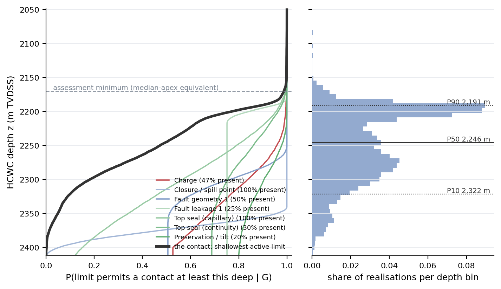
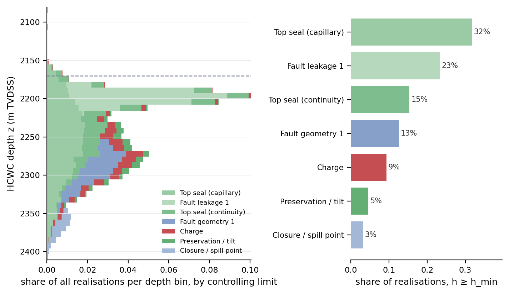
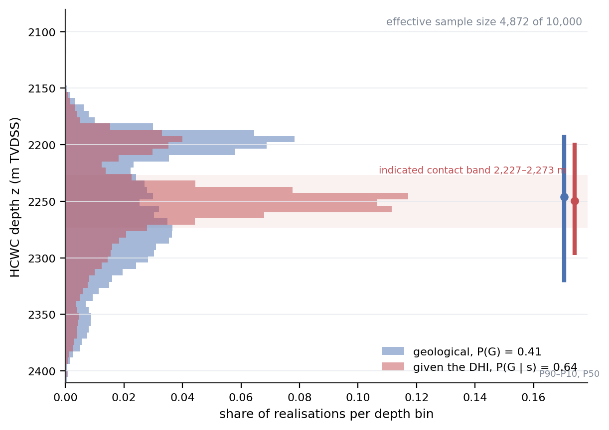
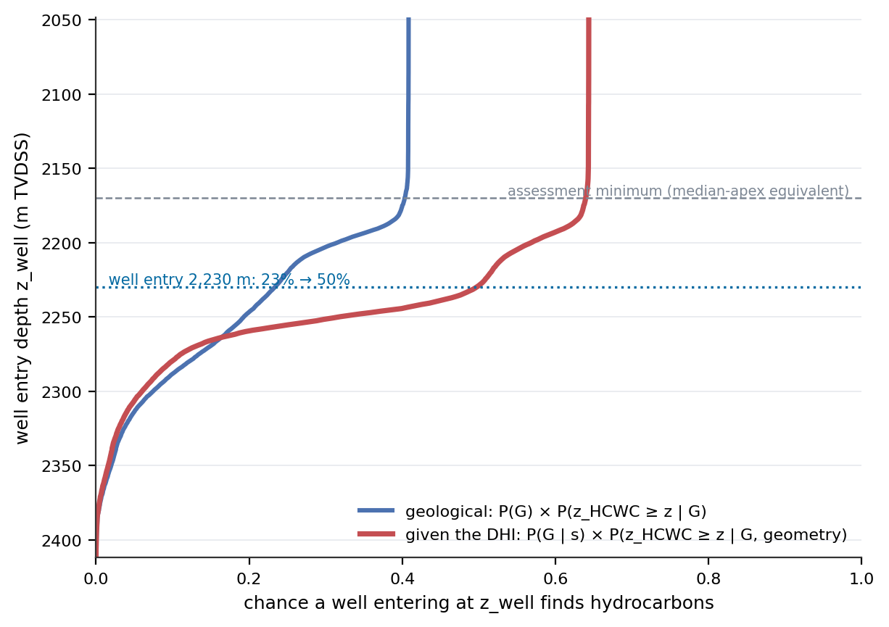
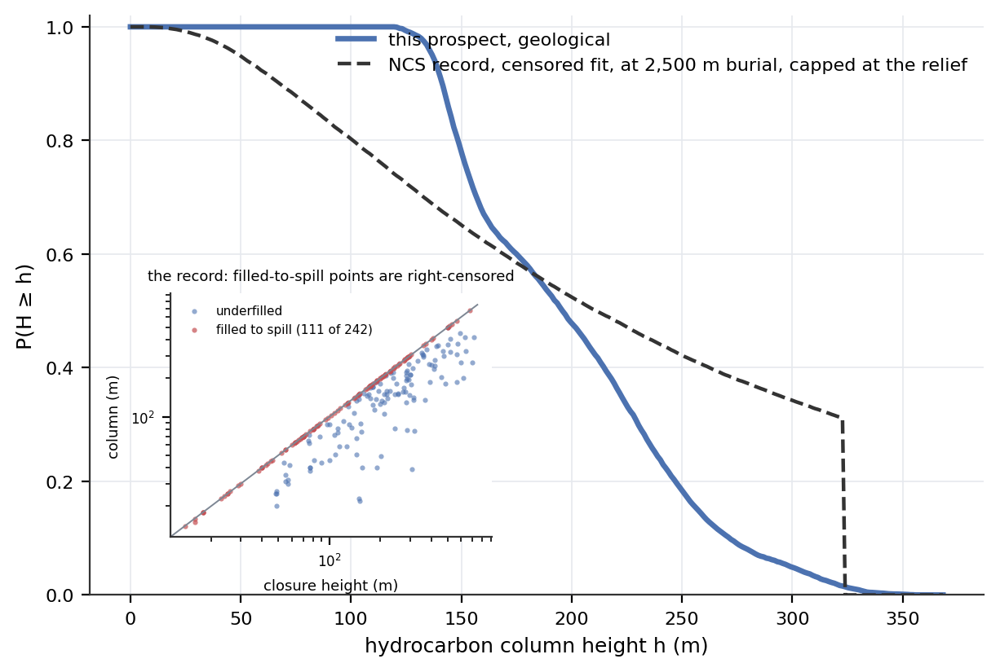

# Let the geology generate the distribution

### Hydrocarbon column height from competing geological limits and DHI evidence

*Lars Hjelm, September 2026. The method is stated in full on tab 8.1 of the HCWC Distribution
Builder; every number below is printed by `scripts/paper_facts.py` from the shipped prospect at
the stated settings.*

---

## The question the distribution should answer

The depth of the hydrocarbon–water contact is often the largest single uncertainty in a
prospect's volume, and it sets the chance that a well at a given location finds hydrocarbons
at all. In most evaluations it is entered as a distribution: uniform from apex to spill, a
three-point estimate from analogues, a lognormal of the column.

Whatever the choice, that distribution carries no connection to the mechanisms that limit the
column. It cannot say which assumption it rests on, which mechanism a deeper contact would
need, or what to change after the well. A detailed Monte Carlo model can still answer the wrong
geological question.

The alternative is to state the mechanisms and let the contact follow. Charge runs out, the
closure spills, a fault juxtaposes the reservoir against a carrier, the seal leaks at a
capillary pressure the column exceeds, the seal fails mechanically, the reservoir pinches out.
Each is a limit with two properties: a probability of being present on this prospect, and a
distribution of the depth or column height at which it acts.

## Competing limits

In every Monte Carlo realisation each limit is drawn twice, once for presence and once for the
depth at which it acts. The shallowest active limit sets the contact, and the mechanism that
set it is recorded. Ten thousand realisations give a contact distribution, a controlling share
for each mechanism, and both as functions of depth.

*Figure 1. Left: each limit's chance of permitting a contact at least this deep, flattening at
its probability of being present; the contact is the lower envelope of the active limits. Right:
the contact distribution that follows, with its P90, P50 and P10.*

This is not new. Beha, Christensen and Young (2012) enumerate the combinations of trapping
elements sealing or failing and derive the leak point that follows; Hood (2019, 2024) frames
column height as a competition between limits; Grant (2020) publishes the controlling-limit
statistic. What is added here is the integration: continuous, correlated limit distributions,
the controller retained per realisation, one framework for the contact, the chance against
depth and the well, and DHI evidence entered as a likelihood over column height. The engine
reproduces Beha's two-fault example to Monte Carlo error.

Limits are sampled, not blended. Averaging a leak into a background column distribution
suppresses the realisations above the leak and leaves the rest untouched, so the blended
distribution corresponds to no geology, and adding a leak can raise the apparent volume (Hood
2024). Taking the minimum keeps every realisation a column that some mechanism produces, at a
depth that mechanism reaches. On the shipped prospect the contact comes out at
2 191 / 2 246 / 2 322 m (P90 / P50 / P10), right-skewed with a step at the spill; the shape is
an output.

## The model shows why the column stops

Because the controller is recorded, the model says which mechanism stops the column and where.
Top-seal capillary capacity sets the contact in 32 % of the realisations that meet the
assessment minimum, fault leakage in 23 %, seal continuity in 15 %, fault geometry in 13 %,
charge in 9 %, preservation in 5 % and spill in 3 %; the remaining limits control under 1 %
between them. The share is not constant down the structure: shallow contacts are
seal-controlled, deep ones pass to fault geometry and spill.

*Figure 2. Left: the contact distribution stacked by the limit that set it, so each depth bin
shows which mechanisms stop the column there. Right: the controlling shares over the
realisations meeting the assessment minimum.*

That table is the sensitivity analysis. Two or three limits set the answer and the rest do not
move it, so the elicitation effort goes where it counts, and a reviewer can disagree with a
mechanism rather than with a curve.

## The chance is a reading of the same curve

The exceedance curve $F(h) = P(H \geq h \mid G)$ is the chance that the column reaches $h$,
given that the geological elements worked. The prospect chance at the assessment minimum, the
smallest column that counts as a discovery, is

$$\mathrm{POS} = P(G) \times F(h_{\min})$$

where $P(G)$ is the product of the element chances, the chance that an accumulation is there
at all. A chance quoted without its threshold means nothing; read at a well's entry depth the
same product, on the realised contacts, is the chance that well finds hydrocarbons. Chance and
volume come off one curve, so they cannot refer to different thresholds.

A trapping element that fails below the crest, a fault window at 2 300 m or a seal that holds
150 m, does not reduce the chance of an accumulation; it reduces the chance of a deeper
contact. Folding it into $P(G)$ understates the chance and, because volume is conditioned on
it, overstates the volume. Here such mechanisms are limits, and $P(G)$ is left to what works at
the crest.

## A DHI is evidence, not a contact

A seismic amplitude with a picked termination is not a contact. It is evidence about one, and
it carries two kinds. Its character, how hydrocarbon-like it reads, is evidence about whether
there are hydrocarbons: placed on a DHI evidence index, it gives a likelihood ratio from two
reference distributions of the index, $\mathrm{LR}(s) = f(s \mid \mathrm{HC}) / f(s \mid \mathrm{NoHC})$,
applied to $P(G)$ by the two-state update $P(G \mid s) = \mathrm{LR}\,P(G) / (\mathrm{LR}\,P(G) + 1 - P(G))$.
Its geometry, where the
indicated event terminates, is evidence about how far down the column reaches, given that it
exists: a likelihood over column height that reweights the geological realisations. Nothing is
re-simulated; every realisation keeps its controlling mechanism, and the same weighted sample
gives the contact, the chance against depth and the well.

The geometry likelihood has a floor. The indicated event is the contact with a stated
probability $c$, the contact attribution; with probability $1 - c$ it is lithology, a
diagenetic front or an artefact, and then it says nothing about depth. So the geometry can
never say more than $c/(1-c)$ against any contact depth, however sharply the pick is drawn.

On the shipped prospect a moderate anomaly, evidence index +20, with a 10 m pick at 2 250 m
and $c = 0.36$, takes the prospect chance from 40 % to 64 % and narrows the P90–P10 spread of
the contact from 130 m to 99 m. The updated distribution has an effective sample size of 4 872
of the 10 000 realisations, which measures how far the seismic displaced the geology: a low
value does not mean the interpretation is wrong, it means the answer depends on it.

*Figure 3. The contact distribution before and after the DHI, on one axis, with the indicated
contact band shaded. The update reweights the geological realisations; the prior stays visible
in the posterior, and the effective sample size says how much of it carries the answer.*

Strong DHI evidence can increase $P(G)$ substantially while the contact stays uncertain. The
evidence index moves the chance and does not touch the weights; the depth uncertainty stays
with the pick, the depth conversion and the attribution. And the DHI cannot say which element
failed: it may say where the contact is, and mechanisms that put a contact there become more
frequent among the favoured realisations, but the element chances are untouched.

## The same posterior gives the chance against depth

*Figure 4. The chance a well finds hydrocarbons against its entry depth, read on the realised
contacts: geological, and given the DHI. The well at 2 230 m and the assessment minimum are
marked.*

The chance at a well entering at 2 230 m goes from 23 % to 50 %. It is not 64 %: $P(G \mid s)$
is the chance of hydrocarbons in the trap at any depth, and a well 180 m below the crest also
needs the column to reach it. The difference between the two is the chance that hydrocarbons are
present but the contact sits above the well, which the attribution $c$ and the geology set, not
the evidence index.

## A reality check, not a score

*Figure 5. The prospect's column beside the NCS record's seal capacity at its burial depth,
capped at the prospect's relief. Inset: the record itself, with the 111 of 242 discoveries that
filled to spill on the 1:1 line.*

The one openly redistributable dataset relating column height to closure height is
Edmundson et al. (2021), 242 discoveries on the Norwegian shelf. 111 of them are filled to
spill. A filled closure says the column reached the structural limit and the seal's capacity
was not tested: a lower bound, not a measurement. Fitted as right-censored, the closure-height
control weakens and the burial-depth control roughly doubles, the direction compaction
predicts. The tool draws the prospect beside the record for a closure of its size and reads
optimistic or pessimistic against it. It never multiplies the record in: every trap in it was a
discovery, so the record can inform where a contact sits, never the chance of having one.

## What this is

A workflow, not a theorem. Competing limits, controlling-mechanism statistics and
depth-dependent risk are published; Bayesian updating is not new. The implementation puts them
in one place, with a trail from every number back to the assumption that moved it. It is open
source and runs without a three-dimensional geomodel.

The distribution is not chosen. The geology generates it.

---

**References.** Beha, A., Christensen, J. E. & Young, R. (2012), Journal of Petroleum Geology
35(1); Edmundson, I. et al. (2021), AAPG Bulletin 105(12); Grant, N. T. (2020), Petroleum
Geoscience; Hood, K. C. (2019, 2024), Rose & Associates; Simm, R. & Bacon, M. (2014), Seismic
Amplitude: An Interpreter's Handbook, Cambridge; Simm, R. (2020), First Break 38(2); Monigle,
P. W. et al. (2025), AAPG Bulletin 109(5); Roden, R., Forrest, M. & Holeywell, R. (2012), The
Leading Edge 31(9). Full references in section 8.1.11 of the tool.
