# Building hydrocarbon–water contact distributions from competing geological limits and DHI evidence

### A stochastic framework with probabilistic DHI updating for pre-drill prospect assessment

**Lars Hjelm**

---

*This article documents a method and the open-source tool that implements it. The tool runs at
[hcwc-builder.streamlit.app](https://hcwc-builder.streamlit.app/) and its source is at
[github.com/lhjelm-dk/HCWC-Builder](https://github.com/lhjelm-dk/HCWC-Builder). Every figure is an
exhibit of the tool, exported unchanged by `scripts/export_exhibits.py`. Every number is produced by
`scripts/paper_facts.py` from the shipped prospect at the settings stated. The method is set out in
full in the tool's theory notes.*

## Abstract

Hydrocarbon–water contact (HCWC) depth is a major source of uncertainty in pre-drill prospect
evaluation and can affect in-place volume estimates by orders of magnitude. The complexity of the
processes controlling HCWC depth means that many assessments represent the uncertainty with a
generic distribution for contact depth or column height, based on analogue fields, regional
statistics, expert judgement, company standards, or a combination. This is practical. But a generic
distribution may over- or underestimate the potential of an individual prospect and hides which
geological mechanisms actually control the column.

Here, column-height uncertainty is derived from competing geological limits rather than specified
directly. Structural spill, charge limitation, top-seal capillary and mechanical capacity, seal
continuity, fault-seal leakage and reservoir pinch-out are represented as uncertain limits, each
with its probability of being active and its depth or capacity uncertainty. In each Monte Carlo
realisation, the shallowest active limit controls the column, and the controlling mechanism is
retained. The result is therefore both a column-height distribution and a record of what controls
it.

The same realisations provide the probability of reaching any column height or well depth, linking
HCWC uncertainty to depth-dependent probability of success and volumetrics without a separate
depth-risk elicitation.

Where seismic evidence indicates a possible HCWC, the DHI is treated as additional evidence rather
than as a deterministic contact. The DHI evidence index updates the probability that a
hydrocarbon-bearing accumulation exists, while the prospect-specific DHI geometry reweights the
conditional HCWC distribution. The resulting posterior is used for both HCWC prediction and
probability of success with depth.

An open-source application implements the workflow and provides the geological assumptions,
controlling mechanisms, DHI update and empirical benchmark in one assessment.

---

## 1 · Introduction

The assumed hydrocarbon column uncertainty propagates directly into prospect volume and probability
of well success. Despite its importance, HCWC is commonly represented by a distribution of possible
contact depths or column heights derived from analogue fields, regional statistics, expert
judgement, company policy, or some combination.

There is nothing inherently wrong with this approach. But it leaves a basic question unanswered:

> What geological process is represented by the selected distribution?

A hydrocarbon column is not a random variable in isolation. Its maximum extent is the outcome of
geological processes: structural spill, charge limitation, seal capacity, seal discontinuity, fault
leakage, reservoir geometry and, in some settings, post-charge processes.

A distribution can of course be derived from statistics of similar prospects. But is that
distribution appropriate for this prospect?

The alternative explored here is to represent the geological mechanisms that may limit the column
and let their competition generate the HCWC distribution. The distribution then becomes an output
of the geological model rather than an input. The same realisations also provide the probability of
reaching a given column height or absolute depth, linking HCWC uncertainty to depth-dependent
probability of success and well risk.

### 1.1 · From trapping elements to HCWC

The competing-limits concept is not new. Beha *et al.* (2012) described consistent volume assessment
of complex traps by considering combinations of trapping elements being present or failing and
deriving the resulting leak points. Hood (2019, 2024) described the stochastic treatment of column
height by sampling background column height and explicit geometric limits and taking the minimum.
Chance as a function of column height is older still: Lowry *et al.* (2005) built a variable risk
array across column heights for the case this paper is written around, a mapped closure whose seal
capacity may limit the column to less than fill-to-spill.

The tool used here follows the same geological principle, but represents the limiting
mechanisms as probabilistic depth or capacity distributions. Charge limitation, structural spill,
fault leakage, seal capacity and continuity, mechanical seal failure and reservoir geometry can
therefore compete within each Monte Carlo realisation.

The shallowest active limit controls the column. The model retains that controlling mechanism, so
the result is not only a distribution of HCWC depths but also a record of what controls the column
and how that control changes with depth.

This is important for risking. The uncertainty is not only described; it is linked to a geological
mechanism that can be examined, challenged or potentially reduced with additional information.

### 1.2 · Incorporating DHI evidence

A DHI provides a different type of information. Its seismic character may provide evidence for
hydrocarbon presence, while its geometry may provide information about the position of the HCWC.

These are treated separately.

The DHI evidence index provides an evidence weight for the hydrocarbon-bearing state:

$$LR(s)=\frac{f(s\mid HC)}{f(s\mid NoHC)}$$

where $s$ is a conceptual DHI evidence index. Combined with the geological accumulation probability
$P(G)$, this gives an updated probability:

$$P(G\mid s)= \frac{LR(s)\,P(G)}{LR(s)\,P(G)+(1-P(G))}$$

The index is relative rather than physical: zero represents neutral evidence, positive values
increasingly positive evidence, and negative values increasingly negative evidence.

The prospect-specific DHI geometry is treated separately as evidence on column height. The
geological HCWC realisations are reweighted according to the likelihood of observing the DHI
geometry for each possible column height:

$$P(H\geq h\mid G,\,DHI)$$

The result is an updated HCWC distribution rather than a deterministic contact placed at the DHI
depth.

This distinction matters. A strong DHI may provide strong evidence for hydrocarbons while the HCWC
remains uncertain because of depth conversion, contact attribution, pick uncertainty or the
possibility that the seismic response is not a contact. Conversely, a deep DHI may support
hydrocarbon presence while still giving a relatively low probability that the column reaches the
minimum required at a particular well.

The same posterior realisations are then used to calculate the probability of reaching any depth.
The DHI therefore affects both the probability of an accumulation and the distribution of where the
hydrocarbon column may terminate, without creating a separate depth-risk model.

### 1.3 · Scope and contribution

The competing geological limits used here are established concepts rather than a new risking
principle. The aim is to combine them in a practical workflow in which geological assumptions
generate the HCWC distribution and the controlling mechanism is retained for each realisation.

The main focus is the integration of DHI evidence with that geological HCWC distribution. DHI
evidence strength updates the accumulation probability, while prospect-specific DHI geometry
updates the conditional HCWC distribution. The resulting posterior provides a common basis for HCWC
prediction, controlling-mechanism analysis and probability of success with depth.

Empirical column-height data are used as a supporting benchmark rather than as a replacement for
prospect-specific geological reasoning. The application is intended to make the assumptions behind
HCWC uncertainty explicit, traceable and testable.

---

## 2 · Column height as the outcome of competing limits

Consider a prospect in which several geological mechanisms may limit the hydrocarbon column. For a
given realisation let $H_\text{charge}$, $H_\text{spill}$, $H_\text{seal}$, $H_\text{continuity}$,
$H_\text{fault}$ and $H_\text{mech}$ be the maximum columns consistent with charge, structural
spill, capillary seal capacity, seal continuity, fault or lateral seal, and mechanical top-seal
failure.

The resulting column height is

$$H = \min\left(H_\text{charge},\,H_\text{spill},\,H_\text{seal},\,H_\text{continuity},\,H_\text{fault},\,H_\text{mech},\,\ldots\right)$$

Only mechanisms active in that realisation enter the minimum, so each carries two separate
uncertainties: whether it is active as a limit, and, given that it is, where it bites. An inactive
mechanism can simply be represented as having no finite limiting height.

A realisation does not contain a weighted average of several possible leak points. It is one
possible geological configuration, in which the first effective limiting mechanism determines the
maximum column. Repeating this over many realisations generates the HCWC distribution and the
statistics of which mechanism controls it.

This is also why a potential leak should not simply be blended into a background column-height
distribution. A leak changes the outcome only for realisations that reach the leak; it should not
reduce the probability of shallower columns. The competing-limit formulation does this by
construction: the background capacity and the geometric limit are sampled separately, and the
minimum is taken for each realisation. Hood (2019) illustrates the same problem, including cases
where representing a deep leak by reweighting the background distribution can produce the
counter-intuitive result of increasing prospect volume.

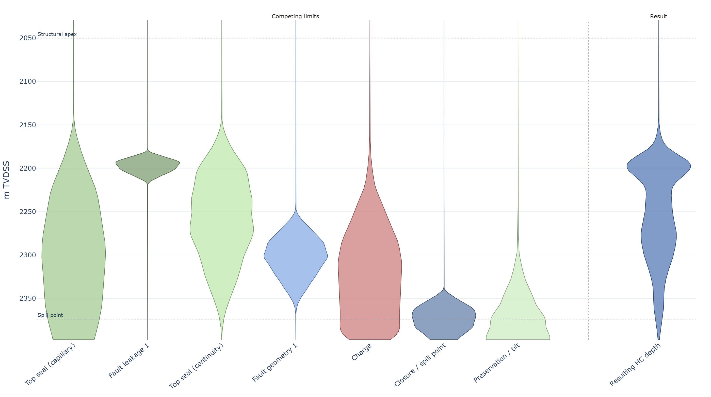

> **Figure 1.** The limiting mechanisms for the worked prospect drawn as violins on a common depth
> axis, with the structural apex and the spill point marked. Each violin is the sampled constraint
> for that mechanism. The HCWC distribution on the right results from taking the minimum of the
> active limits in each realisation, which is why it sits shallower than the bulk of the individual
> limits. No limit is elicited as an HCWC distribution.

A limit is not necessarily a leak point. Some limits represent an actual escape path, such as
structural spill, fault leakage or seal failure. Others limit the column without hydrocarbons
necessarily leaving the trap: charge may be insufficient to fill higher, or reservoir continuity may
terminate the connected pore volume. In all cases the relevant quantity is the maximum column that
can be supported in that realisation.

The distinction is about connectivity rather than the statistics of the depth distribution. A seal
capacity exceeded at 2 200 m only becomes an effective drainage limit if there is a connected escape
path from the accumulation. If the volume beyond the seal is itself closed, exceeding the local seal
capacity does not necessarily empty the trap. In the model, this has to be represented explicitly
through the mechanism activation, the presence of an escape path, or the sampled limiting depth.
Once that decision is made, the minimum assumes it has already been accounted for.

---
## 3 · Geological mechanisms

The limits should be defined in terms of geological processes rather than as arbitrary statistical
distributions. They should ultimately all resolve to the same quantity: metres of hydrocarbon
column. The input may naturally be either a capacity or a mapped depth. A **capacity** — what a seal
can hold, what a fault will leak past — is naturally stated in metres of column below the apex and
does not move when the apex pick moves; a **mapped surface** — spill point, juxtaposition window,
pinch-out — is naturally stated as a depth. The conversion between them uses the apex drawn in the
same realisation, and that is where a known bias enters: $H = z_\text{limit} - z_\text{apex}$
subtracts two picks from the same depth-converted surface.

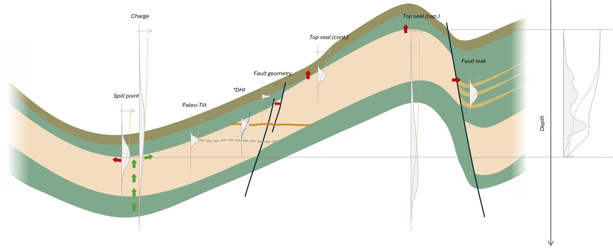

> **Figure 2.** The mechanisms on one section, each with the distribution of the depth at which it
> acts. Charge enters from below and fills downward from the apex, so every capacity is
> measured from the apex. The figure is the elicitation: a limit is entered where its mechanism
> acts, not where a contact is wanted.

**Structural spill** is the maximum column the trap geometry retains. Depth conversion, seismic
interpretation, and closure, fault and pinch-out geometry all make it a distribution rather than a
fixed depth.

A related distinction is whether a distribution is **truncated by spill or terminated at spill**.
Truncating a background column-height distribution with a prospect-specific spill limit leaves the
probability of smaller columns unchanged and creates filled-to-spill realisations where the
background capacity exceeds the structural limit. Simply defining the distribution only below spill
changes the distribution of all smaller columns as well. The competing-limit approach gives the
former behaviour by construction.

**Charge limitation** applies where the available charge is insufficient to fill the trap to a
deeper limit. It should not automatically be represented as a contact at the base of the structure:
if charge fills the structure, it imposes no contact at all. Its column-height distribution can be
computed from an area–depth integration rather than elicited, where basin modelling supplies the
volume potentially available to charge the prospect.

**Capillary seal capacity** gives another maximum column. In a Schowalter-type formulation,

$$h_\text{max} = \frac{2\gamma\cos\theta}{g\,\Delta\rho}\left(\frac{1}{r} - \frac{1}{R}\right)$$

where $r$ is an effective seal pore-throat radius and $R$ the reservoir pore scale, only the
*difference* having to be overcome. Capacity is dominated by the pore-throat radius, since
$P_c \propto 1/r$, and it is **phase dependent**: the density contrast means the same seal supports
a much shorter gas column than an oil one, so the charge phase and the seal fluid must be set
coherently or the contact belongs to no prospect.

**Seal continuity** is a different failure mechanism from capillary breakthrough: a seal may have
ample local capacity while being ineffective because of sand-filled channels, erosional windows or
local thinning, so it is its own mechanism with its own probability of presence.

**Fault seal** adds juxtaposition, shale gouge ratio, fault-rock properties, fault-zone architecture,
reactivation and discrete leak points. Fault *geometry* and fault *leakage* are different mechanisms
even on the same fault, and are separate limits in different risk elements.

**Mechanical top-seal failure** applies in sufficiently overpressured systems. Following Grant
(2020), the supportable column is $H = (S_{H\min} - P_p) / (\text{grad}_w - \text{grad}_h)$: the
headroom between minimum horizontal stress and pore pressure, over the difference in fluid gradients.
The limiting condition is rock failure under stress, not pore-throat entry pressure. Where the
headroom is spent before any hydrocarbon is added, the trap has failed rather than being limited:
that is a retention risk at the crest, not a zero-metre column.

A further question is what happens after mechanical failure. Does the seal heal? Is the accumulated
column lost permanently, or can the system recharge and rebuild it? That is a different problem from
defining the instantaneous failure limit, and needs to be treated explicitly if it is material to
the prospect.

---

## 4 · Monte Carlo implementation

For each realisation $j$, sample the uncertain geological parameters, including apex-depth
uncertainty; determine which limiting mechanisms are active; calculate the limiting column height
for each active mechanism; select the minimum; and **record both the resulting column height and the
controlling mechanism**.

The output is therefore not just $H_1,H_2,\ldots,H_N$, but the pairs $(H_j,M_j)$, where $M_j$ is the
mechanism controlling realisation $j$. The probability that mechanism $i$ controls the column is

$$P(M=i)=\frac{N_i}{N}.$$

This bookkeeping costs one integer array per realisation and is the point of the whole construction.
It distinguishes a mechanism that is *uncertain* from one that is actually *controlling*. Keeping
that information answers a different question from the HCWC distribution itself, and points directly
to what should drive further geological work.

Sampling is performed through each limit's quantile function. Correlation is imposed when the random
draws are generated: a Gaussian copula with a rank-correlation matrix specified by the assessor
allows correlated limits without requiring the individual limit definitions to know about each
other. Mechanism presence is treated separately from the correlation of the active limits; the
implications and limitations of this assumption are discussed later.

---

## 5 · One distribution: contact and risk against depth

The primary output is the probability that the hydrocarbon column reaches at least a specified
height,

$$F(h)=P(H\geq h\mid G)$$

where $G$ is the event that a hydrocarbon-bearing accumulation exists under the assessed geological
risk elements.

This conditioning matters. If there is no accumulation, there is no HCWC to distribute. The column
distribution therefore describes the **conditional geometry of an accumulation**, while $P(G)$
describes the chance that such an accumulation exists in the first place.

If the apex is at $z_\text{apex}$,

$$z_\text{HCWC}=z_\text{apex}+H$$

so the same realisations can be read directly in depth. For a well entering at depth $z$, the
corresponding chance of hydrocarbons is

$$P(G)\,P(z_\text{HCWC}\geq z\mid G).$$

If $h_{\min}$ is the minimum column required by the assessment, then

$$\mathrm{POS} = P(G) \times F(h_{\min}).$$

Both terms are necessary. $P(G)$ asks whether an accumulation exists; $F(h_{\min})$ asks whether that
accumulation reaches the required column. Reporting $F(h_{\min})$ as the prospect POS would therefore
ignore the geological chance $P(G)$.

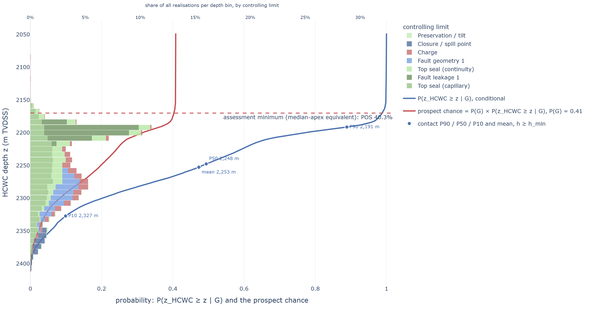

> **Figure 3.** One distribution read in three ways. The conditional curve is the
> probability that the HCWC lies at or below each depth, given an accumulation; the prospect curve
> multiplies this by $P(G)$. The bars show the controlling limit by depth bin. In the worked
> example, $F = 1.00$ at the 5 m assessment minimum, giving a POS of 40.8 %; at the 2 250 m DHI
> pick, $F = 48.3\,\%$, giving 19.7 %. A quoted probability is therefore only meaningful
> together with the depth or column height at which it is read.

### The limits are the risk model

The important point is that prospect POS and the HCWC distribution are not separate assessments. The
limits define both. The distributions entered as column-limiting mechanisms are the geological
statement of how the chance of encountering hydrocarbons decreases with depth.

The same realisations that generate $F(h)$ generate

$$P(G)\,F(h)$$

at every depth. The per-element curves are derived from the same limiting realisations rather than
being allocated independently. Change a seal capacity, fault limit or spill distribution and the
contact distribution, well risk and volume range change together.

This avoids building one depth-dependent risk model for POS and another for HCWC and then trying to
reconcile them afterwards. There was only one model to begin with.

A derived array also cannot contradict itself. The chance of reaching a given column height cannot
rise with that height, since a column that reaches the deeper level has already reached the
shallower one, so $F(h)$ is non-increasing by construction: it is read off one sample of the
competing minima. An array assembled band by band, with a risk stated for each column-height slice,
carries no such guarantee, and a violation is easy to miss because each band looks reasonable on its
own.

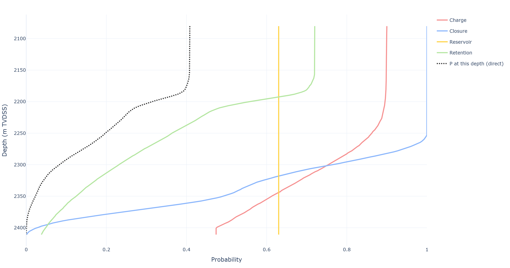

> **Figure 4.** Each element's chance against depth, derived from the shallowest active limit within
> that element and scaled by its element chance. When the element-level limits are
> independent, the product of these curves reproduces the overall contact survival function. With
> correlated elements, that identity does not generally hold; the full Monte Carlo result remains
> the reference. The curves are therefore derived diagnostics for downstream use, not separately
> elicited risks.

---

## 6 · DHI evidence and geometry

### 6.1 · DHI evidence strength

Let $s$ denote a dimensionless DHI evidence index, with zero representing neutral evidence, positive
values increasingly supporting a hydrocarbon-bearing accumulation and negative values increasingly
contradicting it.

The evidence model is described by conditional densities,

$$f(s\mid HC) \qquad\text{and}\qquad f(s\mid NoHC)$$

which give the relative likelihood of observing a given evidence strength under the two states.
Their ratio gives the likelihood ratio,

$$LR(s)=\frac{f(s\mid HC)}{f(s\mid NoHC)}.$$

Applied to the prior accumulation probability,

$$P(G\mid s)= \frac{LR(s)P(G)}{LR(s)P(G)+1-P(G)}.$$

The evidence index therefore changes the probability of the geological accumulation state. It does
not directly define an HCWC.

The relationship is an evidence model rather than a universal physical law. The shape and strength
of the conditional densities depend on the underlying evidence and calibration basis, and should not
be interpreted outside their intended range.

For scale, the one published measurement located for a comparable quantity: Kjønsberg *et al.* (2010)
inverted prestack AVO by Markov chain Monte Carlo offshore Norway and reported prior and posterior
hydrocarbon probabilities implying a likelihood ratio of about 29, at a location later drilled and
found gas. That number carries amplitude and geometry together, so it bounds what the whole seismic
observation was worth rather than the character channel alone. The character channel here is bounded
at 10 either way, after Simm (2020). It is worth knowing what the ceiling looks like before typing a
number into a slider.

### 6.2 · DHI geometry

The DHI geometry provides a second piece of information. A picked event at depth $z$ may be
consistent with a hydrocarbon contact, but both its position and its interpretation are uncertain.

For each geological realisation, the conditional HCWC distribution can therefore be reweighted
according to how compatible that realisation is with the observed DHI geometry. The result remains a
distribution of possible contacts rather than a deterministic contact pick.

This distinction is important. A strong DHI may provide strong evidence that hydrocarbons are
present while leaving substantial uncertainty in the actual HCWC depth. Conversely, a DHI whose
geometry is consistent with a deep contact may support hydrocarbon presence while still giving a low
probability that the accumulation reaches the minimum column required at the well.

### 6.3 · Combined DHI result

The two updates address different questions:

$$P(G) \rightarrow P(G\mid s)$$

updates the probability that an accumulation exists, while

$$P(H\geq h\mid G) \rightarrow P(H\geq h\mid G,\mathrm{DHI\ geometry})$$

updates the conditional column-height distribution.

The resulting prospect probability against depth is therefore

$$P_\mathrm{DHI}(z) = P(G\mid s)\, P(z_\mathrm{HCWC}\geq z\mid G,\mathrm{DHI\ geometry}).$$

The same posterior realisations can be used to calculate the DHI-updated HCWC distribution,
depth-dependent well risk and threshold POS. No separate depth-risk model is required.

---

## 7 · Empirical benchmark and QC

The column-height distributions are built from the geological model, not fitted to an empirical
dataset. An empirical record nevertheless provides a useful QC check: does the resulting range sit
within what has been observed in comparable settings, and where it does not, which geological
mechanism might explain the difference?

Edmundson *et al.* (2021) compiled 242 Norwegian Continental Shelf discoveries with hydrocarbon
column height, trap height, burial depth and trap-fill ratio. Their dataset provides a benchmark
rather than a substitute for prospect-specific geological assessment.

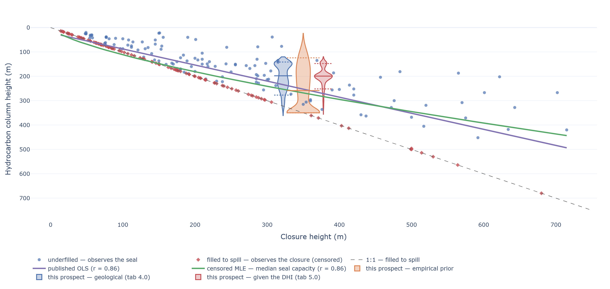

> **Figure 5.** Column height versus closure height for the Edmundson *et al.* (2021) dataset.
> Filled-to-spill discoveries are right-censored: they show that the column reached at least the
> trap height, but do not measure the maximum column the seal could support. Any empirical benchmark
> therefore needs to state how these observations were treated. The three violins are all at this
> prospect's closure height; the geological and DHI ones are nudged either side of the empirical
> prior only so they can be read.

A filled-to-spill discovery tells us that the observed column reached the structural limit; it does
not tell us that the seal would have leaked at that depth. This matters when using the dataset as a
benchmark for seal-supported column height. The comparison should therefore state how filled-to-spill
observations were treated rather than silently treating them as exact capacity measurements.

The purpose of the comparison is not to identify a "true" empirical column-height distribution. It
is a QC check on the prospect model. A material disagreement should trigger a geological question:
is the prospect outside the observed range, or is one of the assumed limiting mechanisms poorly
constrained?

---

## 8 · A worked prospect example — a practical approach

The tool ships with a worked conceptual prospect to illustrate the concepts. This tool offers a
computed charge fill and top-seal capacity, and estimation of fault geometry challenges,
fault leakage probability and fault seal retention distribution, seal continuity and preservation
limits. Element chances are charge 0.90, closure 1.00, reservoir 0.63 and retention 0.72, giving
$P(G) = 0.408$; the assessment minimum is 5 m of column. The DHI readings from Section 9 onwards
use the tool's opening settings as well: an evidence index of 5, a picked event at 2 250 m with a
one-sigma pick and depth-conversion uncertainty of 10 m, and a contact attribution of $c = 0.36$.
All results below are 10 000 realisations at the tool's default seed.

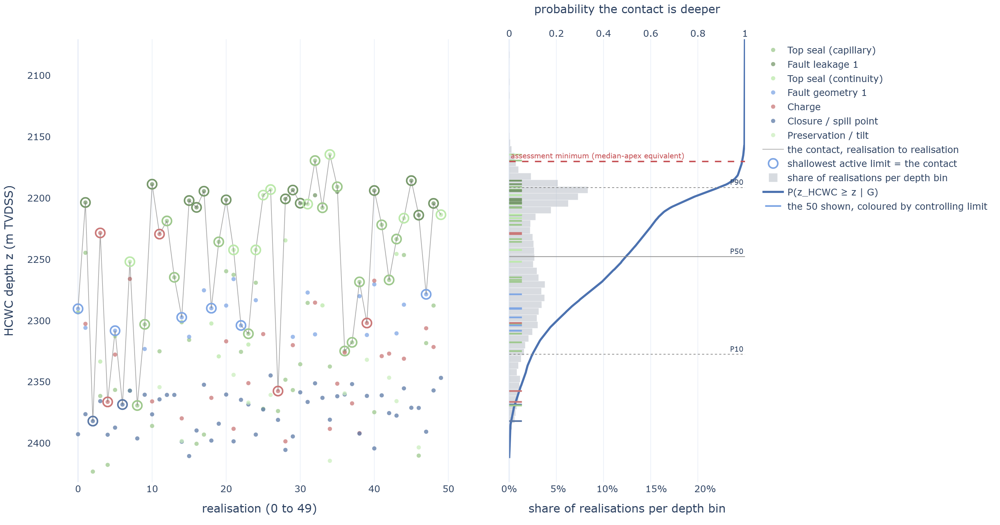

> **Figure 6.** The competition, realisation by realisation. Left: fifty consecutive realisations,
> each coloured dot one limit's sampled depth, the ringed dot the controlling minimum. No limit wins
> consistently. Right: the contact distribution those minima make, with its exceedance curve on the
> top axis. The shape is an output; nothing about it was elicited.

| | |
|---|---:|
| $P(G)$, element product | 0.408 |
| $F(h_{\min})$ at 5 m | 1.000 |
| **Prospect POS** | **40.8 %** |
| HCWC P90 / P50 / P10 | 2 191 / 2 246 / 2 327 m |
| P(filled to spill) | 3.5 % |

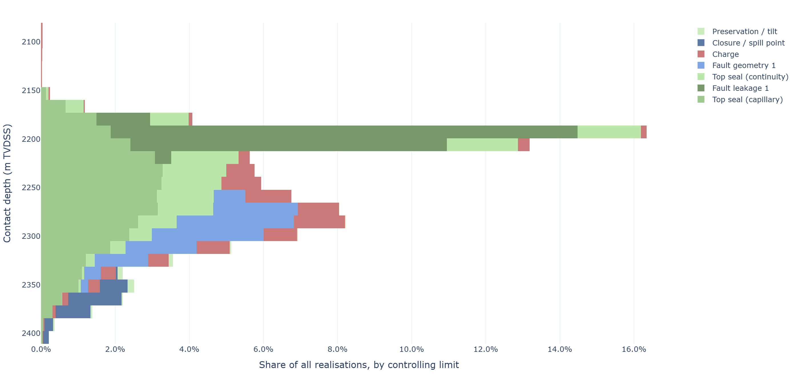

> **Figure 7.** The controlling limit at each depth: the contact distribution stacked by the limit
> that set it, so each depth bin shows which mechanisms stop the column there. Over the realisations
> that meet the assessment minimum, top-seal capillary capacity sets the contact in 34 %, fault
> leakage in 23 %, seal continuity in 16 %, fault geometry in 13 %, charge in 10 % and spill in 4 %,
> the remaining limits in under 1 % each. The share is **not constant down the structure**: shallow
> contacts are almost entirely seal-controlled, deeper ones pass to fault geometry and finally to
> spill, which is the diagnostic a distribution alone cannot provide.

These are controlling-mechanism statistics and display how often each mechanism sets the minimum.
They also indicate what refinements are worth doing: refining the preservation model would move very
little here, because it controls under 1 % of realisations, while refining the seal-capacity
elicitation would move a great deal. A small overall share is not unimportance, though — Figure 7
shows fault geometry controlling a large fraction of the *deep* realisations, which are the ones
that carry the volume.

---

## 9 · Incorporating seismic evidence: the Bayesian update

One way to handle a seismic indication such as an apparent DHI is to define a separate "DHI case"
and substitute its contact depth for the geological HCWC distribution. This keeps the two
assessments separate, but treats the seismic interpretation as a scenario rather than as evidence.

A Bayesian update takes a different approach. The geological model already gives a set of possible
outcomes, each equally likely by construction. The seismic observation then changes how much weight
is given to those outcomes. Realisations that are more consistent with the observation become more
likely; those that are less consistent become less likely.

In simple terms,

$$P(H\mid D)\propto P(D\mid H)\,P(H)$$

where $H$ represents a possible geological outcome and $D$ the seismic observation. The prior term,
$P(H)$, is what the geological model thought was possible before considering the DHI. The likelihood
term, $P(D\mid H)$, asks how plausible the observed seismic response would be if that particular
geological outcome were true.

Because the Monte Carlo realisations are already a sample from the geological model, no new
geological simulation is needed. Each realisation is simply given a new weight according to how well
it matches the seismic observation — self-normalised importance sampling, which for this sample is
an exact Bayesian update conditional on the observation model. The set of possible realisations
stays the same; only their relative importance changes.

This is useful for more than just producing an updated HCWC distribution. Each realisation still
carries the geological mechanism that controlled its column. After the DHI update, the model can
therefore ask not only where the contact is likely to be, but also which geological mechanisms are
now most likely to control it. A simple "DHI case" cannot provide that information.

The same realisations also make the geological and DHI-updated distributions directly comparable.
The prior and posterior differ only in their weights, not in the underlying set of geological
possibilities.

There is one important boundary in the calculation. The HCWC realisations describe the column given
that a hydrocarbon-bearing accumulation exists. The seismic geometry can therefore redistribute
probability between possible column heights, but it does not by itself determine whether the
accumulation exists. That question is handled separately by the DHI evidence strength of Section 6.1.

The two pieces then combine as

$$P_\mathrm{DHI}(h) = P(G\mid s)\, F_\mathrm{post}(h)$$

where $P(G\mid s)$ is the updated probability of a hydrocarbon-bearing accumulation and
$F_\mathrm{post}(h)$ is the DHI-updated probability that the column reaches height $h$.

Each piece of seismic evidence is therefore used for the question it actually addresses: character
updates the chance of hydrocarbons; geometry updates where the column may terminate.

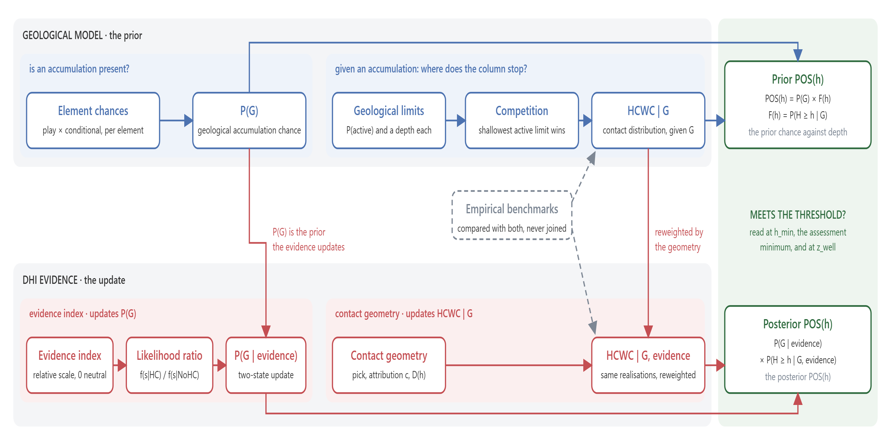

> **Figure 8.** The assessment workflow. The geological model is the prior: element chances give
> $P(G)$, and given an accumulation the HCWC limits compete. The DHI is evidence: the evidence index
> — how strongly the amplitude character supports hydrocarbons — updates $P(G)$, and the apparent
> DHI contact geometry reweights the same realisations, so neither piece of evidence is counted
> twice. Both rows end in the same reading — the chance of meeting the threshold at the assessment
> minimum (POS geological, or POS given the DHI) and at any depth.

---

## 10 · Seismic geometry and seismic character

The Bayesian update separates two different kinds of DHI information: character and geometry. They
answer two different questions, so treating everything as one "DHI factor" can hide what the seismic
evidence is actually telling us.

**Geometry.** The position of an apparent flat event, together with its picking and depth-conversion
uncertainty, gives information about where the hydrocarbon column may terminate. This constrains
$H$, the column height.

**Character.** Amplitude, polarity and phase, conformity, AVO behaviour and consistency with the
expected fluid response — the attributes set out by Simm & Bacon (2014) — give information about
whether the seismic response is consistent with hydrocarbons at all. This constrains the
probability of a hydrocarbon-bearing accumulation, $P(G)$, through the DHI evidence index described
in Section 6.1.

The two therefore need not give the same answer. A strong seismic response can increase confidence
that hydrocarbons are present without fixing the contact depth. Conversely, a well-defined flat
event can constrain the contact position even when the evidence for hydrocarbons is relatively weak.

To illustrate the separation: when the geometry is made deliberately uninformative, the DHI
character can increase the prospect POS significantly while the contact distribution is essentially
unchanged. When the character is neutral and the geometry is informative, the contact distribution
becomes narrower while the overall prospect chance changes very little. When both are used, both
effects are present. Character and geometry often point in the same direction, since both improve
with data quality and impedance contrast; where they do not, the disagreement is information worth
reporting rather than an error to reconcile.

The distinction is therefore structural rather than just a convenient way of arranging the
calculation: character updates the chance of an accumulation; geometry updates where the column may
terminate.

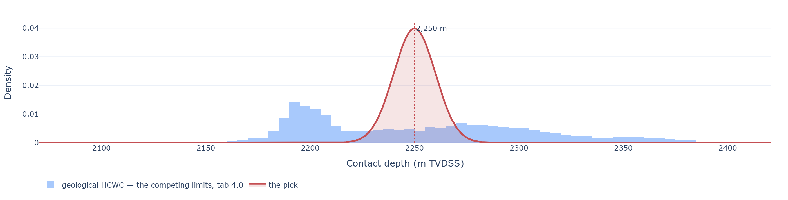

> **Figure 9.** The two inputs of the geometry channel. Blue is the geological contact distribution
> from the competing limits; red is the interpreted event with its uncertainty. Here the pick is
> about five times sharper than the geology and sits near its median, which is why it narrows the
> answer without moving it.

### 10.1 · What the geophysicist has to supply

The tool needs three inputs that are already part of normal seismic interpretation.

First, the depth of the interpreted event and its uncertainty. This includes both picking
uncertainty and depth-conversion uncertainty. Together they describe where the apparent contact
might actually be.

Second, the probability that the picked event is the HCWC at all, written $c$. A flat event may be a
real fluid contact, but it may also be a lithological boundary, processing artefact or another
seismic event. The parameter $c$ describes this attribution uncertainty given that hydrocarbons are
present.

Third, a detection function $D(h)$: the probability that a hydrocarbon column of height $h$ would
produce a mappable seismic anomaly.

The detection function is normally small for columns below seismic resolution, increases as the
column becomes easier to detect, and eventually approaches a ceiling below 1. It is deliberately not
allowed to reach certainty. Otherwise, an absent anomaly could become infinitely strong evidence
against a particular column height.

The tool uses a simple logistic form for $D(h)$. This is a practical detectability model, not a
physical seismic model. Being monotone, it also cannot represent a response that weakens again with
thickness, as a Class III sand's can when the top and base responses separate.

No new geological risk elements are required and the geological Monte Carlo simulation is not rerun.
The seismic information is applied to the existing geological realisations.

### 10.2 · The second question is not the first one restated

It is tempting to derive $c$ directly from the strength of the DHI: if the anomaly is bright and
convincing, surely the event bounding it is also likely to be the HCWC.

The distinction is useful because these are actually two different judgements. The split below is
drawn here, across the five DHI attributes Monigle *et al.* (2025) grade into a single score.

DHI character attributes such as anomaly strength and lateral amplitude contrast mainly address:

> Are hydrocarbons likely to be present?

These are the attributes reflected in the DHI evidence index and $P(G\mid s)$.

Contact-geometry attributes such as fit to structure, flatness, amplitude termination and evidence
for a fluid-contact reflection address:

> Is this particular event likely to be the HCWC?

These determine $c$.

The two judgements are related. Better data and stronger impedance contrast may improve both. But
they do not have to. A bright anomaly can have a poor or irregular termination and therefore a low
$c$. A weak anomaly can have an exceptionally flat, conformable event that gives relatively high
confidence that the event is the contact.

That is why $c$ should not simply be calculated from the DHI likelihood ratio. For example,

$$c=\frac{LR}{LR+1}$$

looks like a natural conversion of likelihood ratio to probability, but it is actually the posterior
probability from an even prior. $c$ is a different quantity: it is the probability
that the picked event is the contact conditional on hydrocarbons being present.

The evidence for hydrocarbons therefore belongs in the first part of the calculation, while the
evidence that the picked event is actually the contact belongs in the second. Keeping the two
separate prevents the same seismic observation from being counted twice.

Monigle *et al.* (2025) describe an empirical relationship between a multi-attribute DHI score and
the weight given to a DHI-indicated contact in their own scenario construction. The tool
shows that relationship as a comparison, not as a calibration of $c$ for the present model.

### 10.3 · When does detectability matter?

The detection function $D(h)$ can look like an important part of the seismic model, but its effect
depends strongly on the situation.

For a seen anomaly, detectability may add relatively little when all columns of interest are already
well above the detection threshold. That is the case in the worked prospect: with a detection
midpoint of 25 m against a P50 column of 197 m, essentially all relevant realisations lie on the
upper part of the detection curve, and none in the run falls between the two. Changing $D(h)$
therefore has little effect on the result.

In this case, the more important uncertainty is whether the picked event is actually the contact.
The contact-attribution parameter $c$ determines how strongly the seismic pick is allowed to favour
some depths over others. On the worked prospect the difference is plain: replacing $D(h)$ with a
constant leaves the exceedance curve unchanged, while removing the floor that $c$ places under the
pick likelihood moves it by up to 22 points of exceedance (Section 13.1).

Detectability becomes more important in two situations.

First, when the anomaly is absent. A missing anomaly can then provide negative evidence: a large
column that should have been easy to detect becomes less likely. Within the hydrocarbon-bearing
state this is represented by

$$P(\text{no DHI}\mid h,G)=1-D(h).$$

This is discussed further in Section 12.

Second, detectability matters when the detection threshold falls inside the range of column heights
supported by the geological model. In that situation, seeing an anomaly provides information not
only about whether hydrocarbons are present, but also about how large the column is likely to be.

The practical point is therefore simple: do not assume that detectability is always the dominant DHI
uncertainty. Check where the detection threshold sits relative to the geological column-height
distribution, and check the contact attribution $c$. In the worked prospect, the latter matters more
for a seen anomaly.

---

## 11 · Evidence reshapes the HCWC distribution rather than scaling it

A seismic observation does more than simply increase or decrease prospect POS by one factor. The
character part of the evidence changes the probability that hydrocarbons are present, while the
geometry part changes which HCWC outcomes are more or less likely.

This means that the seismic update can change the shape of the column-height distribution, not just
its overall level. A DHI near a particular depth can increase the probability of contacts around
that depth, while reducing the probability of contacts that are less consistent with the
observation.

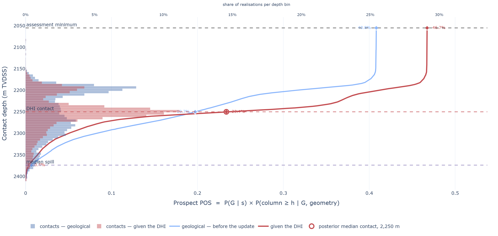

> **Figure 10.** The chance of reaching each depth, before and after the seismic update, for a pick
> centred near 2 250 m with $c = 0.36$: $P(G) \times F(h)$ geological against
> $P(G \mid s) \times F(h \mid G, \text{geometry})$ updated. The evidence index updates the
> probability of a hydrocarbon-bearing accumulation, which scales the curve; the geometry then
> reweights the possible HCWC depths, so realisations compatible with the interpreted event receive
> more weight and less compatible depths receive less. At the assessment minimum the prospect chance
> goes from 41 % to 47 %; read off the same curves at 2 230 m, a well entering there goes from 23 %
> to 36 %.

Read as depth-dependent risk, the effect is no longer a simple upward shift of the POS curve. The
chance of reaching depths around the interpreted contact increases, while the chance at depths
beyond the part of the distribution supported by the DHI can decrease.

That is the important difference from applying a single POS multiplier. A multiplier changes the
level of the curve but leaves its shape unchanged. A scenario switch has a different problem: it
replaces one interpretation with another rather than updating the probabilities within the
geological model.

The likelihood-based approach does both things in the same calculation: the evidence index changes
the overall chance of an accumulation, while the DHI geometry changes the conditional distribution
of possible column heights. The result can therefore move the expected contact, narrow the
uncertainty, or move and narrow it at the same time.

How much it moves is set by the stated uncertainty of the interpretation. A broad likelihood leaves
the geological model with substantial influence; a narrow one lets the seismic observation dominate
the conditional contact distribution. That is not in itself a defect. A well-imaged, conformable
event at a confidently picked depth is better evidence about where the contact sits than an elicited
seal capacity, and a model that refused to let it win would be wrong. The requirement is that the
strength of the update follows from the stated uncertainty of the interpretation rather than from
declaring a separate DHI case.

The worked prospect shows all three effects depending on the seismic input. In the example shown
here, the strongest effect is to concentrate the contact distribution around the interpreted event.
The numerical consequences are read directly from the depth-risk curve in Figure 10.

Because the update is a reweighting rather than a replacement, the geological model remains intact.
The same geological realisations are still present, with the same competing limits and controlling
mechanisms; the seismic evidence simply gives some realisations more weight than others. The limits
are therefore still the risk model, now read at the posterior weights.

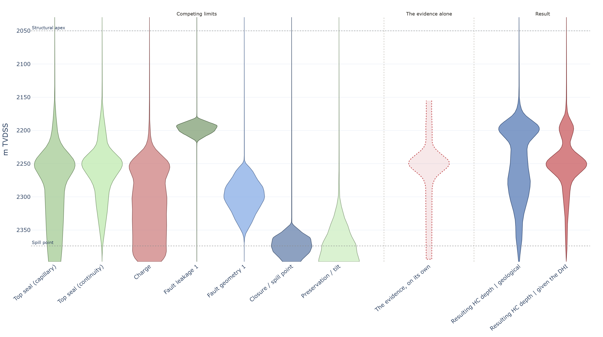

> **Figure 11.** The competing limits after the seismic update, drawn as violins on a common depth
> axis. The same geological limits and realisations are retained, but they are reweighted according
> to how well their resulting HCWC is supported by the DHI geometry. The middle lane is the evidence
> on its own, drawn hollow because it is a likelihood rather than a count of realisations, so its
> shape carries the information and its area does not; the result on the right shows the geological
> HCWC distribution and the one given the DHI side by side. The contact is still the minimum of the
> active limits; the seismic evidence changes the relative weight of the possible geological
> outcomes.

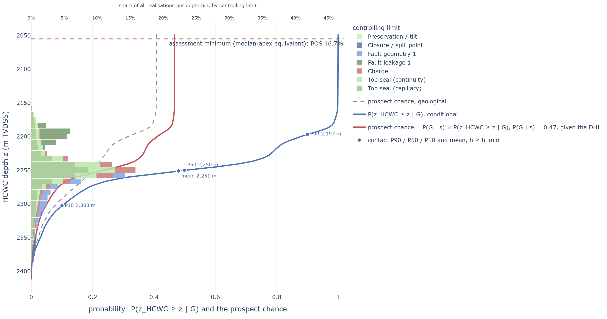

> **Figure 12.** The updated result in the same form as Figure 3, so the geological and DHI-updated
> results can be compared directly. The conditional HCWC distribution and the probability against
> depth are derived from the same posterior realisations. They therefore move together: when the
> seismic evidence changes which contact depths are more likely, it changes both the HCWC
> distribution and the chance of reaching each depth.

---

## 12 · Absence as evidence

A missing DHI can also contain information, but only when the seismic data were good enough that an
anomaly should reasonably have been visible.

This is the important distinction. No DHI is not the same as evidence against hydrocarbons. A deep
or poorly resolved column may simply produce no mappable response. In that case, the absence tells
us very little.

Whether a column could display a DHI at all is the real issue. That is a geophysical question and
it is not resolved here; the detection function $D(h)$ is an attempt to provide the link. It
describes the probability that a hydrocarbon column of height $h$ would produce a mappable anomaly.
If no anomaly is observed, the likelihood of that column is therefore

$$P(\text{no DHI}\mid h,G)=1-D(h).$$

Within the hydrocarbon-bearing state $G$, this can reshape the HCWC distribution. Large columns that
should have produced an easily visible anomaly become less likely, while smaller columns that could
have escaped detection are less affected.

This is the mirror image of the seen DHI in Section 11. Seeing an anomaly favours the parts of the
geological distribution where the anomaly was likely to occur; not seeing one favours the parts
where it could reasonably have remained undetected.

There is a second question, however: does the absence of a DHI also reduce the probability that
hydrocarbons are present at all?

Published practice does treat it that way. Monigle *et al.* (2025) count an absent anomaly as a
negative line of evidence within an integrated chance-of-success framework, and report a prospect
carried from a geological 46 % to an integrated 8 % on that basis. They also note that the practice
"is not consistently applied in industry", which is a fair description of how differently an absent
anomaly is weighted from one assessment to the next.

That requires another assumption. A dry prospect can still contain seismic anomalies caused by
lithology, processing, noise or other non-hydrocarbon effects. The strength of the negative evidence
therefore depends not only on how detectable a real hydrocarbon response would have been, but also
on how often a similar anomaly could occur without hydrocarbons.

The tool treats this separately from the column-height update. The geometry and detectability part
can reshape the HCWC distribution within $G$; a separate likelihood ratio can then update $P(G)$
when the false-positive rate is specified.

The two effects should not be confused. A missing DHI may tell us that the column is probably not
very large, that hydrocarbons may be less likely altogether, or both. How much it tells us depends
on the seismic quality, the expected detectability and the assumed false-positive rate.

The worked prospect is deliberately used here to illustrate the principle rather than to provide a
universal number. With the default detectability assumptions, absence has little effect on the
column distribution because the relevant columns are already above the detection threshold. Changing
the detection threshold into the range of plausible column heights makes absence much more
informative and shifts the HCWC distribution towards shorter columns.

The false-positive assumption is less constrained. The tool opens at a rate of 0.5, the
maximum-ignorance value, and labels it as such. It is therefore best treated as an explicit
sensitivity rather than hidden inside the DHI result. A high false-positive rate makes absence
relatively uninformative; a low false-positive rate makes an absent expected DHI stronger negative
evidence for $G$.

A negative value on the DHI evidence index is a related but different observation: it represents
negative seismic character, whereas this section deals with the absence of an expected anomaly. They
are not automatically combined.

---

## 13 · What the DHI evidence cannot override

A DHI can be strong evidence, but it is still only evidence within a geological model. It should not
simply replace that model.

This becomes particularly important when the interpreted contact lies outside the range that the
geological model considers plausible.

### 13.1 · When the DHI conflicts with the geological model

The seismic geometry is represented by a likelihood: contact depths close to the interpreted event
are more consistent with the seismic observation than depths farther away. The width of that
likelihood reflects the uncertainty in the interpretation of the DHI as a contact.

There is, however, a floor to this likelihood. The picked event may not be the HCWC at all. It could
be a lithological boundary, a diagenetic front, a processing artefact, or another seismic event that
happens to look like a fluid contact.

This means that even a very sharp and confident pick does not make the corresponding contact depth
certain. The seismic interpretation can strongly favour a particular depth, but it cannot remove the
geological alternatives completely.

This becomes important when the DHI and the geological model disagree.

If the interpreted contact falls within the range supported by the geological model, the seismic
evidence can pull the HCWC distribution towards the interpreted depth. The stronger and more precise
the seismic evidence, the more strongly it can do so.

But if the interpreted contact is moved progressively further outside the geological support, there
are fewer geological realisations that can accommodate it. The seismic likelihood therefore has less
and less ability to move the distribution. Eventually, the update effectively says that the seismic
anomaly is unlikely to represent the HCWC at that depth, rather than moving the HCWC to a depth for
which the geological model provides little support.

This is an important distinction: the model can conclude that the anomaly is probably not the HCWC
without concluding that the HCWC is at the anomalous depth.

This may seem counter-intuitive. A strong DHI can provide strong evidence that hydrocarbons are
present while providing much weaker evidence that the DHI itself marks the HCWC. These are two
different questions:

> Are hydrocarbons likely to be present?

> Is this particular seismic event the HCWC, and if so, where is the contact?

The DHI character can provide evidence for the first question, while the geometry and contact
interpretation address the second. A strong answer to the first does not automatically provide a
strong answer to the second.

Where the contact turns out to lie, relative to the band the pick defines, is the same distinction
read after the well:

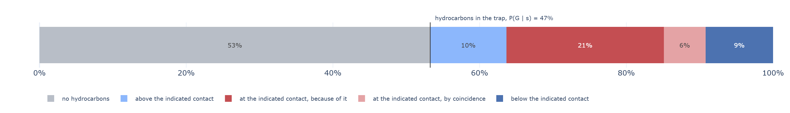

> **Figure 13.** The outcomes of a seen DHI in depth order, as shares of all outcomes. The first is
> off the depth axis: no hydrocarbons, the DHI a false hydrocarbon indicator. The four others share
> $P(G \mid s)$: the contact above the indicated contact band, within it because the DHI is the
> contact, within it by coincidence, and below it.

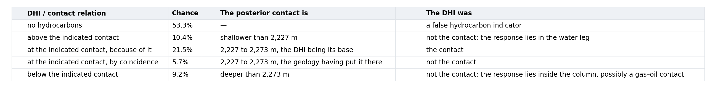

> **Table 1.** The same outcomes as numbers, at the scenario this paper reads throughout. The two
> rows within the band are separated by the branch of the likelihood that put the contact there: the
> posterior attribution — the chance the DHI is the contact, given the geology as well — is 0.47
> against a stated $c$ of 0.36, because the pick landed where the geology already expected a contact.

This is also why the DHI should not simply be treated as a new HCWC scenario. The geological model
is retained, and the seismic evidence changes the relative probability of its possible outcomes.

### 13.2 · A DHI does not rewrite the geological risk

There is a second boundary that is just as important.

A DHI provides evidence that hydrocarbons may be present. It does not tell us which geological risk
element would otherwise have failed.

A bright spot does not retrospectively improve the charge argument. Nor should it automatically
increase the reservoir, closure or retention chances.

In the model, the geological element chances are therefore set independently of the DHI. The seismic
evidence is applied as additional evidence rather than being fed back into the individual geological
risk elements.

This avoids a simple form of double counting: using the same DHI both as evidence for hydrocarbons
and as a reason to improve the geological assumptions that were used to calculate the original POS.

The distinction is consistent with published guidance on DHI integration. Monigle *et al.* (2025),
for example, argue that geological risking should remain independent of DHI attributes.

---

## 14 · Dependence between the two channels

Separating DHI geometry from DHI character raises an obvious question: aren't the two related?

They are. A strong and conformable anomaly is more likely to produce a clear, mappable termination
than a weak or poorly defined anomaly. Treating geometry and character as completely independent
observations would therefore be difficult to justify.

The model does not, however, treat them as two independent pieces of evidence that are simply
multiplied together.

They answer different questions. The evidence channel asks how the DHI changes the probability that
hydrocarbons are present, $P(G)$. The geometry channel asks how the DHI changes the distribution of
possible HCWC depths, conditional on hydrocarbons being present.

The two updates are therefore applied to different parts of the model:

$$P(G\mid s)$$

and

$$P(z_\mathrm{HCWC}\geq z\mid G,\mathrm{DHI\ geometry}),$$

where $s$ is the evidence index of Section 6.1. The final depth-dependent probability combines
these two pieces, as Section 6.3 sets out:

$$P(G\mid s)\, P(z_\mathrm{HCWC}\geq z\mid G,\mathrm{DHI\ geometry}).$$

This is not an assumption that the two observations are independent. It is a way of keeping two
different inferences separate and avoiding applying the same evidence twice.

**The dependence is still there.** The more difficult issue is the judgement used to describe the
DHI.

The characteristics used to assess whether a seismic event is a convincing HCWC — for example
amplitude, conformance to structure and the quality of the flat event, which are the attributes the
published drilled-prospect rankings put first (Roden *et al.*, 2012; Nixon *et al.*, 2018) — are
also characteristics that influence how convincing the DHI is as evidence for hydrocarbons.

An interpreter who sees a very strong, conformable DHI may therefore reasonably give both a high
evidence strength and a high confidence that the event represents the HCWC. Those judgements are
related.

The model cannot remove that dependence mathematically. It has to be addressed during interpretation
and elicitation by being explicit about what each judgement is intended to represent.

The practical rule is therefore simple:

> Do not use the same DHI attribute twice for the same inference.

Character should inform the probability of hydrocarbon presence. Geometry should inform the
distribution of possible contact depths. The two may be related, but they should not become two
independent reasons for making the same update.

Character informs whether hydrocarbons are present; geometry informs where the HCWC may be.

---

## 15 · Limitations and scope

The framework is deliberately simplified. It is not a substitute for basin modelling, hydrodynamic
modelling, remigration and palaeo-contact reconstruction, compartmentalisation, three-dimensional
fluid-flow simulation or pressure-history modelling.

Instead, it provides a probabilistic framework for combining geological limits and seismic evidence
once the relevant geological information is available.

More detailed external models can therefore be used to provide inputs to the framework. For example,
a basin or hydrodynamic model may provide a range of possible fluid-potential limits, migration
effects or palaeo-contacts. These can then be represented as one of the geological limits
controlling the HCWC distribution. The framework does not need to reproduce the underlying process
if a suitable probabilistic description of its resulting limit can be supplied.

### 15.1 · Dependence between geological mechanisms

Mechanism presence is currently drawn independently. The uncertainty in the depth of a limit can be
correlated, so that related geological uncertainties move together, but the model currently treats
the question of whether each mechanism is present as a separate probability.

This is a simplification. In reality, the presence of one mechanism may provide information about
another. Faults may share a reactivation history, for example, or several trapping elements may be
controlled by the same structural event.

The element chances used to calculate the geological POS are likewise treated as conditionally
independent when they are combined. These dependencies are therefore an area where a more integrated
geological model could improve the framework.

### 15.2 · Multiphase columns

The current implementation treats the HCWC through the charge and limiting mechanisms rather than
explicitly modelling separate gas–oil and oil–water columns.

This becomes more complicated when several fluid phases are present. A gas–oil contact near the
crest and an oil–water contact deeper in the structure may be controlled by different capillary
entry pressures. The top seal may therefore be exposed to gas in one part of the structure and oil
in another, with different leakage limits for each phase.

A future extension could therefore treat phase-specific columns and limiting mechanisms, rather than
using a single HCWC distribution. This would also allow the same framework to be used to assess the
spatial probability of gas, oil and water separately.

### 15.3 · The seismic likelihood is a modelling assumption

The seismic update is only as good as the observation model behind it. The likelihood is not a
measurement of certainty; it is a way of representing how compatible different geological outcomes
are with the seismic observation.

Several inputs therefore involve interpretation or specified assumptions: the form and parameters of
the detection function, the uncertainty around the picked event, the probability that the event is
actually the HCWC, and the assumed probability of a spurious event.

The Bayesian update is exact conditional on the specified observation model. The uncertainty lies
in the assumptions themselves.

This is why the seismic inputs should be exposed and tested rather than hidden in the model. If
changing an assumed pick uncertainty, detection threshold or contact-attribution probability moves
the result more than the geological uncertainties do, that is itself useful information about the
assessment.

The treatment of DHI evidence will also differ between companies and interpreters. A useful direction
for future development is therefore to replace the single generic evidence relationship with
likelihoods tied more explicitly to individual geological risk elements or groups of elements. For
example, evidence relating primarily to source and charge could be represented separately from
evidence relating to reservoir presence or retention. This would allow the seismic evidence model to
reflect the way different organisations already assess DHI evidence, while keeping the underlying
geological risk model explicit — which is the explicit dependency model Section 13.2 requires before
evidence is allowed to touch individual elements.

A second direction concerns the inputs rather than the evidence. Every elicited number in the model
carries an unstated confidence: a seal capacity read from one analogue and one read from a
calibrated dataset enter the same distribution and are treated alike. Lowry *et al.* (2005) rate
how well a factor is known separately from the probability assigned to it, so that an extreme
probability supported by thin evidence is visible as such. Carrying a comparable rating on each
elicited limit, and reporting it beside the result, would say how much of the answer rests on
well-constrained inputs — a question the effective sample size answers only for the seismic
update.

### 15.4 · Effective sample size

The effective sample size (ESS) is a diagnostic of the seismic geometry update, not a verdict on the
interpretation.

The reweighting can concentrate the posterior on part of the original geological ensemble. ESS
indicates how much of that ensemble the result effectively depends on. A low ESS does not mean that
the interpretation is wrong; it means that the result is strongly dependent on a relatively small
part of the original geological ensemble.

This is useful to know when quoting the result, particularly when a very precise seismic
interpretation has strongly reshaped the geological distribution. On the worked prospect the
geometry narrows the P90–P10 spread of the contact from 136 m to 106 m on an effective sample of
4 857 of the 10 000 realisations. ESS applies to the geometry reweighting only; the DHI evidence
index updates the overall probability of hydrocarbon presence without discarding geological
realisations.

### 15.5 · Where this leaves the framework

These limitations define the intended scope rather than invalidate the approach. The framework is
designed to provide a common probabilistic layer between geological understanding, HCWC uncertainty
and seismic evidence.

More detailed basin, pressure, fluid-flow or seismic models can supply better constraints where they
are available. The purpose here is to provide a way of carrying those constraints through to the
HCWC distribution and the resulting probability of finding hydrocarbons as a function of depth,
without replacing the underlying geological uncertainty with a single deterministic DHI
interpretation.

---

## 16 · Discussion and conclusions

The principal advantage is conceptual rather than computational. A directly elicited HCWC
distribution asks the assessor to specify the final uncertainty; the competing-limits approach asks
them to specify the mechanisms that produce it. These mechanisms mean different things — geometry,
retention against buoyancy and leakage, lateral containment, petroleum-system uncertainty, or
mechanical seal failure. Once represented as competing limits, the contact distribution becomes an
emergent property of the model rather than an input to it. The probability of achieving a given
column height is likewise derived from the same model.

The construction separates what is uncertain from what controls the outcome. A mechanism may carry
considerable uncertainty but have little influence if it rarely provides the minimum, while a
relatively narrow uncertainty in a dominant mechanism can move the whole distribution. The
assessment therefore retains an explanation of its own answer, making it more defensible under
review and more auditable after drilling. A dry hole or unexpectedly small discovery can then be
evaluated in terms of the geological mechanism that was misassessed, rather than simply by asking
why the HCWC distribution was too deep.

The seismic extension follows the same principle. A DHI is evidence about the subsurface fluid
distribution, not a new HCWC model. Treating the DHI as a likelihood over column height allows the
evidence to update the existing geological model while keeping the underlying mechanisms intact. The
extent of the update can then be reported explicitly rather than hidden in an adjusted POS.

In summary:

1. **Column height can be derived rather than specified.** The maximum column in each realisation is
   set by the shallowest active geological limit, and the HCWC distribution is the output of the
   model.
2. **The HCWC limits are also the risk model.** HCWC depth, the probability of achieving a specified
   column height, and the prospect POS are different readings of the same underlying model. With a
   geological success term $P(G)$ and a minimum required column height $h_{\min}$,
   $\mathrm{POS} = P(G) \times F(h_{\min})$, where $F(h_{\min})$ is the conditional
   probability of achieving the required column given the geological conditions represented by the
   HCWC model. Using the conditional term alone would therefore overstate the prospect by a factor
   of $1/P(G)$, because it implicitly assumes the geological conditions represented by $G$ occur
   with certainty.
3. **Controlling mechanisms can be identified explicitly.** Recording the argmin turns a
   distribution into a diagnostic of which uncertainties control the assessment, and how their
   influence changes with depth.
4. **How the distribution meets the spill point is consequential.** Truncating a background
   column-height distribution by an independently sampled spill point produces filled-to-spill cases
   at a rate determined by the competing seal and spill uncertainties. Simply terminating the
   distribution at spill removes that distinction and assigns essentially no probability to filling
   to spill.
5. **Empirical discovery data require care.** Filled-to-spill discoveries provide evidence that the
   observed column can be retained, but they are lower bounds on seal capacity rather than
   measurements of it. In addition, both column height and trap height depend on the interpretation
   of the structural apex, so empirical constraints are not independent of structural uncertainty.
6. **Seismic DHI evidence can be incorporated as evidence.** Likelihood weighting requires no
   re-simulation, preserves the attribution of the underlying geological mechanisms, and reshapes
   the depth-dependent risk rather than simply scaling it. Each piece of evidence should enter once,
   in the factor it is evidence about. The effective sample size provides a diagnostic of how
   strongly the DHI has displaced the geological prior, while the likelihood floor prevents a single
   interpretation from completely excluding the geological model.

The objective is not a more sophisticated distribution for its own sake. It is to make the
distribution a consequence of explicit geological assumptions — so that it can be defended,
reviewed, and corrected after drilling. An open-source application implements these concepts during
prospect evaluation without requiring a three-dimensional geomodel. It does not determine whether a
prospect should be drilled; it provides a transparent representation of one of the key uncertainties
informing that decision.

---

## References

Beha, A., Christensen, J. E. & Young, R. (2012). A general method for the consistent volume
assessment of complex hydrocarbon traps. *Journal of Petroleum Geology* **35**(1), 85–97. doi:10.1111/j.1747-5457.2012.00520.x

Edmundson, I., Davies, R., Frette, L. U., Mackie, S., Kavli, E. A., Rotevatn, A., Yielding, G. &
Dunbar, A. (2021). An empirical approach to estimating hydrocarbon column heights for improved
predrill volume prediction in hydrocarbon exploration. *AAPG Bulletin* **105**(12), 2381–2403.
doi:10.1306/03122119223. Data: https://osf.io/6ysbv/ (CC-BY 4.0).

Grant, N. T. (2020). Using Monte Carlo models to predict hydrocarbon column heights and to assess
the value of seal capacity data. *Petroleum Geoscience* **27**(2).

Hood, K. C. (2019). *Hydrocarbon column height.* Risk Coordinator Workshop #17, Houston,
14 November 2019. ExxonMobil Upstream Integrated Solutions.

Hood, K. C. (2024). *Hydrocarbon column heights*, Parts 1 and 2. Rose & Associates.

Kjønsberg, H., Hauge, R., Kolbjørnsen, O. & Buland, A. (2010). Bayesian Monte Carlo method for
seismic predrill prospect assessment. *Geophysics* **75**(2), O9–O19.

Lowry, D. C., Suttill, R. J. & Taylor, R. J. (2005). Advances in risking exploration prospects.
*The APPEA Journal* **45**(1), 143–158. doi:10.1071/AJ04012.

Monigle, P. W., Hedayati, T. S. & Goulding, F. J. (2025). Integrated and improved direct hydrocarbon
indicators: a step forward in petroleum risk discrimination. *AAPG Bulletin* **109**(5), 617–636.
doi:10.1306/04042524030.

Nixon, S., Hallam, T. & Constantine, N. (2018). Direct hydrocarbon indicators: risk and value.
*First Break* **36**(6), 71–78.

Roden, R., Forrest, M. & Holeywell, R. (2012). Relating seismic interpretation to reserve/resource
calculations: insights from a DHI consortium. *The Leading Edge* **31**(9), 1066–1074.

Simm, R. & Bacon, M. (2014). *Seismic Amplitude: An Interpreter's Handbook.* Cambridge University
Press.

Simm, R. (2020). Pitfalls in the use of AVO and DHI analysis. *First Break* **38**(2), 61–67.
